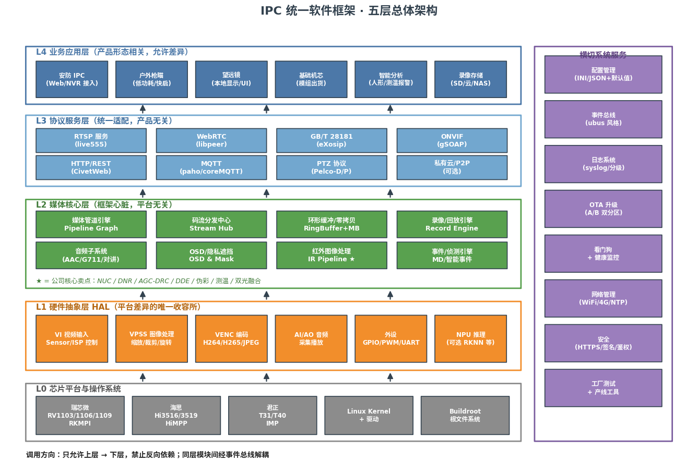
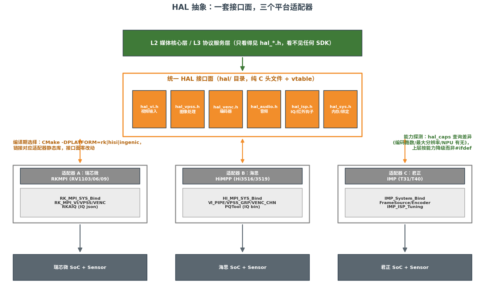
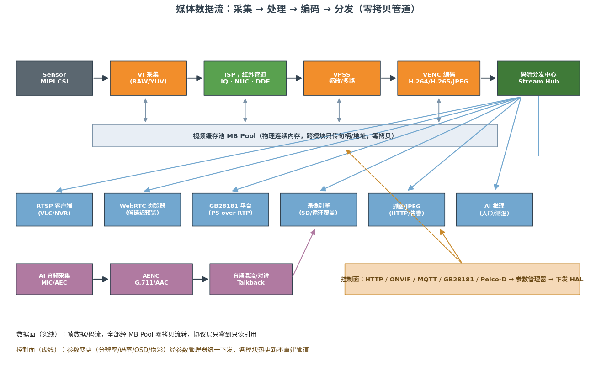
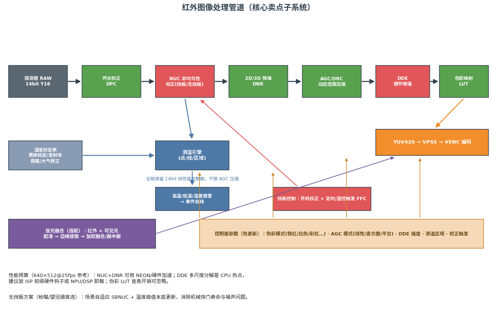

# 面向全产品线的 IPC 嵌入式软件框架架构设计（含关键代码骨架）

> **一句话结论**：采用"五层单向依赖"架构——L0 芯片平台、L1 硬件抽象层（HAL）、L2 媒体核心层、L3 协议服务层、L4 业务应用层，外加一组横切系统服务；用**纯 C 接口面 + vtable** 的 HAL 把瑞芯微 RKMPI、海思 HiMPP、君正 IMP 三套 SDK 的媒体管道（采集→处理→编码）抽象成同一张"管道图"，让协议栈（RTSP/WebRTC/GB28181/ONVIF/MQTT/HTTP/PTZ）与红外图像处理管道**完全不感知平台差异**；所有跨模块数据经零拷贝缓存池流转，所有控制指令经统一参数管理器热更新下发。这套结构同时满足可移植性、高内聚低耦合、上层对下层细节不可见三项核心诉求。

---

## 1. 设计目标、范围与策略

### 1.1 为什么必须做统一框架

公司产品线横跨安防类 IPC、户外枪瞄、望远镜、基础机芯四类形态，底层又同时维护瑞芯微、海思、君正三套嵌入式平台。如果按传统做法"每个产品拉一个 SDK demo 改改"，最终会得到 4×3=12 套互相不可复用的代码，每个协议（如 GB28181）要在 12 个地方各实现一遍，每个 Bug 要修 12 次。开源社区的实践已经反复验证了相反路径的正确性：OpenIPC 固件用 Buildroot 构建统一根文件系统，用同一个流服务器核心（Majestic / Divinus / Mini）覆盖海思、君正、瑞芯微、SigmaStar 等多家 SoC，其中开源的 Mini/Divinus 就是通过"平台 SDK 目录 + CMake 工具链文件"的方式切换底层，而上层的 RTSP、移动侦测、OSD 逻辑一份代码通用[^3^][^20^]。Thingino 社区则在君正单平台上用 Prudynt 流服务器支撑了 165 款以上摄像头型号[^6^][^8^]。这两个项目证明：**流媒体与协议核心收敛为一份、平台差异收敛到适配层**，是 IPC 软件规模化唯一可行的结构。

本框架的设计目标因此明确为三条。**第一，一份协议栈**：RTSP、WebRTC、GB/T 28181、ONVIF、HTTP、MQTT、Pelco 云台等所有协议只实现一次，运行在抽象接口之上。**第二，一套红外管道**：NUC、降噪、AGC/DRC、DDE、伪彩、测温、双光融合作为公司核心卖点，必须是平台无关的一等公民子系统，而不是某个平台上的外挂算法。**第三，产品形态即配置**：安防 IPC、枪瞄、望远镜、机芯的差异只体现在 L4 应用层与配置文件上，底层四层完全同一份代码。

### 1.2 非目标与边界

为避免范围失控，以下内容明确**不属于**本框架：手机 App、云端业务平台、Web 前端页面的实现（框架只负责设备端 HTTP/WebSocket/MQTT 接口，供它们调用）；ISP 底层图像质量调试（IQ tuning 是各平台 PQ 工具链的职责，框架只提供 IQ 文件的加载与切换机制）；NPU 推理算法本身（框架提供推理结果的订阅通道与 OSD 叠加能力）。枪瞄/望远镜的低功耗快启动策略、安防 IPC 的 7×24 录像策略等产品级策略放在 L4 实现，框架只提供机制。

### 1.3 文档组织

第 2 章给出功能全景与产品矩阵，作为架构覆盖面的验收基准；第 3 章定义五层模型与依赖规则；第 4～8 章逐层展开，每章含"设计要点 + 平台/选型对比表 + 关键代码骨架"；第 9 章给工程结构与构建系统；第 10 章给实施路线图、验证计划与风险清单；第 11 章列出可借鉴的开源项目。

---

## 2. 需求全景：功能清单与产品矩阵

### 2.1 协议与互联功能

"当下所有智能网络摄像头的功能全部都需要"这句话拆解成可验收的协议清单如下。安防 IPC 的商用基线可以参考大立 SG 系列双光测温机芯这类产品的标配：H.264/H.265 编码、RTSP、ONVIF、GB28181、HTTP/HTTPS、NTP、FTP、DDNS、RS485，测温数据还要支持 SDK 与 Modbus RTU/TCP 输出[^83^][^84^]。本框架的协议覆盖面以此为底、再向上扩展 WebRTC 与 MQTT：

| 类别   | 协议/功能                                         | 用途与要点                                                                                                        |
| ---- | --------------------------------------------- | ------------------------------------------------------------------------------------------------------------ |
| 实时流  | **RTSP/RTP/RTCP**                             | 监控行业标准，VLC/NVR/VMS 直连；嵌入式主流用 live555，其单线程 select 事件模型天然适合对接硬件编码输出队列[^25^]                                    |
| 低延迟流 | **WebRTC**                                    | 浏览器/App 亚秒级预览、双向对讲；设备端用纯 C 的 libpeer（支持 H.264/G.711/OPUS/DataChannel/STUN/TURN，信令可走 WHIP 或 MQTT）[^39^][^53^] |
| 国标平台 | **GB/T 28181-2016/2022**                      | 国内安防强制互联标准，设备端基于 eXosip/osip 实现 SIP 栈；2022 版新增注册重定向、PTZ 精准状态查询、设备软件升级、图像抓拍等信令[^147^][^30^]                   |
| 设备互联 | **ONVIF Profile S/T**                         | S 管基础流与 PTZ，T 增加 H.265、HTTPS、双向音频、移动/遮挡事件[^120^][^125^]；实现用 gSOAP 由 WSDL 生成框架代码[^28^]                        |
| 管理接口 | **HTTP/HTTPS REST + WebSocket**               | Web 配置页与第三方集成；选 CivetWeb（MIT 许可、单文件嵌入、支持 WebSocket/HTTPS），避开 Mongoose 的 GPL+商业双许可风险[^94^][^102^]             |
| 物联接入 | **MQTT**                                      | 告警上报、远程控制、云平台对接；选 paho-mqtt-c 或 coreMQTT                                                                     |
| 云台控制 | **Pelco-D/P（RS485）+ ONVIF PTZ + GB28181 PTZ** | 三路入口统一收敛到内部 PTZ 服务；Pelco-D 为 7 字节帧（同步头 0xFF + 地址 + 命令×2 + 速度×2 + 校验）[^111^][^117^]                           |
| 辅助网络 | NTP、DHCP、DNS、DDNS、UPnP/mDNS 发现、FTP/SMTP 告警    | 商用机标配项[^83^][^127^]                                                                                          |
| 可选扩展 | 私有云 P2P、RTMP/SRT 推流、GB35114 国密安全              | 按产品裁剪；GB35114 在 28181 之上加国密签名与证书[^34^]                                                                       |

### 2.2 媒体与智能功能

视频能力要求多码流（主流+子流+JPEG 抓拍）、H.264/H.265/MJPEG、OSD（时间/通道名/自定义）、隐私遮挡、镜像翻转、双向语音对讲（含回声消除）。智能能力要求移动侦测、人形/车辆检测（有 NPU 的平台）、以及红外产品线特有的测温报警与双光融合——商用双光机芯普遍支持点/线/区域测温、±2℃ 或 ±2% 精度、高温/低温/温差告警、14 种伪彩、画中画与可见光温度叠加[^83^][^85^][^92^]。存储能力要求 SD 卡循环录像、计划录像、告警联动录像、可选云存储与 NAS。这些功能在消费级 IPC 上已是标配（双向语音、人形侦测、TF 卡+云存储双备份等）[^122^][^129^]，在框架里必须以能力开关形式全部存在。

### 2.3 产品形态 × 功能裁剪矩阵

四类产品共享同一套二进制框架，差异通过配置与编译开关裁剪：

| 功能域 | 安防 IPC | 户外枪瞄 | 望远镜 | 基础机芯 |
|---|---|---|---|---|
| RTSP/ONVIF/GB28181 | ● 全量 | ○ 可裁 | ○ 可裁 | ● 全量（模组卖点） |
| WebRTC/HTTP/MQTT | ● | ●（手机 App 直连） | ● | ● |
| 录像（SD/云） | ● 7×24 | ○ 触发式短录像 | ○ 触发式 | △ 由整机厂决定 |
| 红外管道（NUC/DDE/伪彩） | ● | ● 核心 | ● 核心 | ● 核心 |
| 测温/双光融合 | △ 按型号 | ● 核心 | △ 按型号 | △ 按型号 |
| PTZ（Pelco/ONVIF） | ● | ○ | ○ | △ |
| 低功耗/快启动 | ○ | ● 核心约束 | ● 核心约束 | ○ |
| 本地显示/UI | ○ | ●（目镜屏） | ●（目镜屏） | ○ |

●=必需 ○=通常裁剪 △=按 SKU 配置。这张矩阵直接决定 L4 的产品配置 schema（见 8.2 节）。

---

## 3. 总体架构：五层单向依赖模型

### 3.1 分层结构



框架自上而下分五层，另有一组横切系统服务贯穿各层：

| 层 | 名称 | 职责 | 平台相关性 | 变更频率 |
|---|---|---|---|---|
| L4 | 业务应用层 | 产品形态逻辑、UI/目镜屏、产品策略 | 产品相关 | 高 |
| L3 | 协议服务层 | RTSP/WebRTC/GB28181/ONVIF/HTTP/MQTT/PTZ | 平台无关 | 中 |
| L2 | 媒体核心层 | 管道引擎、码流分发、录像、音频、红外管道、OSD、侦测 | 平台无关 | 低 |
| L1 | 硬件抽象层 HAL | VI/VPSS/VENC/音频/外设/NPU 的统一接口面 | 平台相关（唯一） | 极低 |
| L0 | 芯片平台与 OS | RKMPI/HiMPP/IMP SDK、内核、Buildroot 根文件系统 | 平台相关 | 极低 |

### 3.2 依赖规则（信息隐藏的制度化）

用户特别强调的三条原则在本框架中被制度化为以下硬性规则：

**规则一：单向依赖。** 只允许上层调用下层（L4→L3→L2→L1→L0），严禁反向。下层需要向上"汇报"时（例如 VENC 产出了一帧码流、测温引擎触发了报警），一律通过**回调注册**或**事件总线发布**完成，下层代码中不得出现上层的任何符号。这条规则使得任何一层都可以被单独替换：换掉 L1 的瑞芯微适配器为君正适配器，L2 及以上零改动。

**规则二：头文件即防火墙。** 上层只能 include 下一层 `include/` 目录里的纯 C 头文件；下层的 `.c` 实现、私有结构体、SDK 原生类型对上层**物理不可见**（私有头文件放在 `src/` 内不导出）。例如 L2 媒体核心看到的编码器只有 `hal_venc_chn_t` 不透明句柄和 `hal_venc_stream_t` 码流包，`RK_MPI_VENC_GetStream` 与 `HI_MPI_VENC_GetStream` 的差异被完全封死在 L1 内部——这就是"高层次对低层次不可见性"在构建系统层面的落地：CMake 只把 `hal/include` 加入上层 include path。

**规则三：同层解耦走总线。** 同层模块之间不直接互相调用，经**事件总线**（发布/订阅）或**参数管理器**（集中式配置下发）交互。例如"移动侦测引擎"和"录像引擎"互不认识：侦测引擎只发布 `EVENT_MOTION`，录像引擎订阅该事件后自行决定启停录像。新增一个"告警上传 MQTT"功能时，只需新增一个订阅者，已有模块零改动——高内聚低耦合靠这条规则保证。

**规则四：能力探测优于条件编译。** 平台差异不通过 `#ifdef RK_PLATFORM` 散落到业务代码，而是 L1 在初始化时上报一张**能力表**（hal_caps：最大编码路数/最大分辨率/有无 NPU/有无硬件 DDE 等），上层读表做功能降级。业务代码里出现平台宏即视为架构违规，在 Code Review 中拦截。

### 3.3 进程模型

推荐**单进程多线程为主、微进程为辅**的混合模型。媒体核心、协议服务、应用逻辑运行在同一个主进程（内部用线程池与事件循环），理由是：码流跨进程搬运的成本（unix socket 转发一帧 4Mbps 码流要过两次拷贝）远高于单进程内共享只读引用；主进程崩溃由看门狗整体拉起，配合 A/B 分区 OTA 保证可恢复。仅以下情况拆独立进程：OTA 升级代理（必须独立于主业务存活）、Web 服务的可选隔离、以及工厂测试工具。OpenIPC/Thingino 采用"一流媒体核心进程 + 若干系统服务进程"正是这一模型的社区验证[^3^][^8^]。进程间（主进程↔OTA 代理等）通信选 ubus 风格的轻量总线（Unix domain socket + JSON-RPC），而非 D-Bus——ubus 单守护进程、基于 libubox 事件循环，内存与体积远小于双守护进程的 D-Bus，正是为嵌入式低内存环境设计[^109^][^116^]。

---

## 4. L1 硬件抽象层（HAL）：平台差异的唯一收容所

### 4.1 三平台媒体模型的同构性

HAL 能成立的前提是三套 SDK 概念模型高度同构——这不是巧合，而是 IPC SoC 的行业共识架构：

| 概念 | 瑞芯微 RKMPI（RV1103/1106/1109） | 海思 HiMPP（Hi3516/3519） | 君正 IMP（T31/T40） |
|---|---|---|---|
| 视频输入 | VI dev/chn | VI pipe/chn | FrameSource chn |
| 图像处理 | VPSS grp/chn | VPSS grp/chn（AUTO/USER 模式） | IVS / ISP 直接输出 |
| 编码 | VENC chn（H264/H265/JPEG，CBR/VBR） | VENC chn | Encoder chn（支持 CappedQuality 等）[^64^] |
| 模块连接 | `RK_MPI_SYS_Bind` 绑定后数据自动流转[^63^] | `HI_MPI_SYS_Bind`，GROUP 仅绑一个输入源[^72^] | `IMP_System_Bind` |
| 零拷贝内存 | MB 缓存池，块地址在模块间传递[^66^] | 视频缓存池 VB，只传缓存块地址[^73^] | rmem + Frame 句柄（支持 nocopy 取帧）[^67^] |
| ISP/IQ | RKAIQ + JSON IQ 文件（RKISP Tuner 调试）[^138^][^145^] | PQ 工具链 + bin IQ 文件[^137^] | IMP_ISP_Tuning API |
| 音频 | AI/AO + AENC/ADEC | AI/AO + AENC/ADEC | AI/AO，G711/G726/ADPCM，可注册自定义编码器[^75^] |
| 取流方式 | `RK_MPI_VENC_GetStream`（阻塞/超时） | `HI_MPI_VENC_GetStream` | `IMP_Encoder_GetStream`（轮询） |

三家的差异集中在：枚举与结构体命名、绑定粒度（dev/pipe/chn 层级不同）、VPSS 工作模式、IQ 文件格式与加载时机、取流的阻塞语义。因此 HAL 的抽象策略是：**以"通道 + 绑定图"为元模型**，把每个硬件环节抽象为带 ID 的通道对象，把连接关系抽象为绑定边；属性结构体取三家能力的**并集的常用子集**，平台特有项放入 `attr_ext` 扩展字段。

### 4.2 HAL 接口面与适配器



HAL 对外只暴露六个头文件（`hal/include/`）：`hal_sys.h`（初始化、绑定、内存池、能力表）、`hal_vi.h`、`hal_vpss.h`、`hal_venc.h`、`hal_audio.h`、`hal_isp.h`（IQ 与红外钩子）、`hal_peri.h`（GPIO/PWM/UART/看门狗）。三个适配器各自由一个静态库实现：`libhal_rk.a`、`libhal_hisi.a`、`libhal_ingenic.a`，CMake 按 `-DPLATFORM=` 链接其一。实现方式推荐**编译期单态**而非运行时插件：一个固件只服务一种 SoC，编译期确定可消除 vtable 间接开销与误配风险，二进制更小；接口仍按 vtable 风格设计，是为保留未来一固件多平台的可能与单元测试打桩便利。

### 4.3 关键代码骨架：HAL 接口面

```c
/* hal/include/hal_types.h —— 上层唯一可见的类型集 */
#ifndef HAL_TYPES_H
#define HAL_TYPES_H
#include <stdint.h>
#include <stdbool.h>
#include <stddef.h>

typedef int hal_chn_t;                 /* 不透明通道句柄 */
typedef enum { HAL_PIX_NV12, HAL_PIX_YUV420P, HAL_PIX_RGB888,
               HAL_PIX_Y16,            /* 红外 14/16bit 线性数据 */
               HAL_PIX_JPEG, HAL_PIX_H264, HAL_PIX_H265 } hal_pixfmt_t;
typedef enum { HAL_RC_CBR, HAL_RC_VBR, HAL_RC_AVBR, HAL_RC_QPMAP } hal_rc_mode_t;

/* 帧：零拷贝引用，句柄指向平台 MB/VB 块，上层只读 */
typedef struct {
    hal_pixfmt_t fmt;
    uint32_t width, height, stride;
    uint64_t pts_us;                   /* 统一微秒时间戳 */
    void    *mb_handle;                /* 平台私有，禁止解引用 */
    void    *vir_addr;                 /* 映射后的虚拟地址（只读） */
    uint32_t data_len;
    uint32_t seq;
} hal_frame_t;

/* 码流包（VENC 输出） */
typedef struct {
    hal_pixfmt_t codec;                /* H264/H265/JPEG */
    const uint8_t *data;               /* 只读指针，有效期至 release */
    uint32_t len;
    uint64_t pts_us;
    bool     is_iframe;
    void    *priv;                     /* 平台私有释放上下文 */
} hal_stream_pack_t;

/* 能力表：上层按此降级，不用 #ifdef */
typedef struct {
    uint32_t max_vi_chn, max_venc_chn;
    uint32_t max_width, max_height;
    bool     has_npu, has_jpeg_hw, has_audio;
    bool     has_ir_hook;              /* ISP 前级可挂红外算法 */
    char     platform[16];             /* "rv1106" / "hi3516dv300" / "t31x" */
} hal_caps_t;
#endif
```

```c
/* hal/include/hal_venc.h —— 编码器统一接口（其余 hal_*.h 同风格） */
#ifndef HAL_VENC_H
#define HAL_VENC_H
#include "hal_types.h"

typedef struct {
    hal_pixfmt_t codec;
    uint32_t width, height;
    uint32_t fps;
    hal_rc_mode_t rc;
    uint32_t bitrate_kbps, gop;
    const void *attr_ext;              /* 平台扩展，普通产品置 NULL */
} hal_venc_attr_t;

/* 码流回调：L1 内部取流线程触发，数据只在回调作用域有效 */
typedef void (*hal_venc_stream_cb)(hal_chn_t chn,
                                   const hal_stream_pack_t *pack,
                                   void *user);

int  hal_venc_create (hal_chn_t chn, const hal_venc_attr_t *attr);
int  hal_venc_destroy(hal_chn_t chn);
int  hal_venc_start  (hal_chn_t chn, hal_venc_stream_cb cb, void *user);
int  hal_venc_stop   (hal_chn_t chn);
/* 控制面热更新：不重建通道 */
int  hal_venc_set_bitrate(hal_chn_t chn, uint32_t kbps);
int  hal_venc_request_idr(hal_chn_t chn);
int  hal_venc_set_fps    (hal_chn_t chn, uint32_t fps);
#endif
```

```c
/* hal/src/rk/hal_venc_rk.c 片段 —— 差异被锁在适配器内部 */
static void *rk_venc_rx_thread(void *arg)
{
    rk_chn_ctx_t *ctx = arg;
    VENC_STREAM_S st;
    while (ctx->running) {
        if (RK_MPI_VENC_GetStream(ctx->chn, &st, 200) == RK_SUCCESS) {
            hal_stream_pack_t pack = {
                .codec   = ctx->codec,
                .data    = RK_MPI_MB_Handle2VirAddr(st.pstPack->pMbBlk),
                .len     = st.pstPack->u32Len,
                .pts_us  = st.pstPack->u64PTS,
                .is_iframe = st.pstPack->DataType.enH264EType == H264E_NALU_ISLICE,
                .priv    = &st,
            };
            ctx->cb(ctx->chn, &pack, ctx->user);       /* 同步回调 */
            RK_MPI_VENC_ReleaseStream(ctx->chn, &st);  /* 回调返回即释放 */
        }
    }
    return NULL;
}
/* 海思适配器同构：HI_MPI_VENC_GetStream / ReleaseStream；
   君正适配器：IMP_Encoder_GetStream + IMP_Encoder_ReleaseStream（需轮询节奏控制） */
```

要点：回调作用域即数据生命周期，上层若需跨线程使用必须引用计数或拷贝（见 5.2 Stream Hub 的零拷贝策略）；`attr_ext` 是唯一逃生门，默认 NULL，防止滥用导致抽象泄漏。

---

## 5. L2 媒体核心层：框架的心脏

### 5.1 管道引擎与数据流



媒体核心层把"VI→(红外管道/ISP)→VPSS→VENC→分发"声明为一张**管道图（Pipeline Graph）**，用配置而非代码描述：每个产品/每个 sensor 组合对应一段 JSON 管道描述，引擎解析后调用 HAL 建立通道与绑定。三大 SDK 的绑定语义（VI-VPSS-VENC 逐级 bind 后硬件自动流转[^63^][^72^]）意味着**主流链路根本不进 CPU**，CPU 只在需要算法处理（红外、OSD 软件叠加、AI 前处理）或取流分发时触碰数据。枪瞄/望远镜这类无 VPSS 多路需求的产品，图退化为"VI→红外管道→VENC"三点一线，同一引擎两种图。

### 5.2 码流分发中心（Stream Hub）与零拷贝环形缓冲

所有协议服务（RTSP、WebRTC、GB28181、录像、HTTP 抓拍）都是码流的"消费者"，而 VENC 取流线程只有一个。Stream Hub 是唯一的分发者：每个编码通道对应一个**订阅者列表 + 环形缓冲**。设计要点：

- **SPSC/MPSC 无锁环形队列**：采集侧（L1 取流回调）是高优先级生产者，多个协议线程是消费者；若用互斥锁共享队列，一帧处理阻塞会反压采集造成丢帧卡顿，正确做法是基于原子 CAS 的无锁 RingBuffer[^19^]。
- **写一次、读多路、引用计数**：码流包进入 Hub 后拷贝一次到 Hub 自有的 per-channel 环形内存区（这块内存从 MB Pool 申请，避免与平台缓存池混用），各消费者持只读游标；GOP 边界对齐淘汰——任何订阅者慢到追不上时，**跳到下一个 IDR 帧**而不是阻塞或乱序丢帧，保证解码器永远从完整 GOP 开始。
- **背压隔离**：单个慢消费者（如弱网 WebRTC 端）只淘汰自己的游标，绝不影响 RTSP 与录像。

```c
/* core/stream_hub.h —— L2 对 L3 的分发接口 */
typedef struct sh_channel sh_channel_t;
typedef struct {
    const uint8_t *data; uint32_t len;
    uint64_t pts_us; bool is_iframe; hal_pixfmt_t codec;
} sh_pack_t;                       /* Hub 自有缓冲，订阅期内有效 */

sh_channel_t *sh_open (int venc_chn);            /* 内部接 hal_venc_start */
int  sh_close(sh_channel_t *ch);
/* 订阅：返回游标；SLOW_SKIP_GOP 策略内建 */
typedef struct sh_sub sh_sub_t;
int  sh_subscribe  (sh_channel_t *ch, sh_sub_t **out);
int  sh_read       (sh_sub_t *sub, sh_pack_t *pack, int timeout_ms);
void sh_unsubscribe(sh_sub_t *sub);
/* 关键帧预热：新订阅者立即获得最近 IDR（WebRTC/RTSP 秒开必需） */
int  sh_request_idr(sh_channel_t *ch);
```

### 5.3 录像/回放引擎

录像引擎是 Stream Hub 的一个订阅者，职责：按通道写 MP4/私有索引格式到 SD 卡、循环覆盖（按容量/天数双阈值）、计划录像与事件录像（订阅事件总线的 `EVENT_MOTION`/`EVENT_TEMP_ALARM` 做预录 5~10s 的事件段）、断点索引修复（掉电后重建索引）。回放经 RTSP 回放流或 HTTP 下载两条出口，均复用 Hub 接口把文件读成 sh_pack_t 重新分发。存储介质健康（SD 卡坏块、挂载失败）上报健康监控服务。

### 5.4 音频子系统

采集（AI）→ AEC 回声消除 → 编码（G.711A/µ、AAC）→ 音频 Hub（与视频 Hub 同构、小容量环）；对讲反向链路：协议层收到对端音频 → 解码 → AO 播放。音视频的同步锚点是**统一微秒时基**：L1 把各家 PTS 归一到 `hal_time_now_us()`，RTCP 的 NTP 映射、录像音画对齐、GB28181 的 PS 打包时间戳全部从该时基派生。君正平台注意其 ADPCM 为 ADPCM_ORG_DVI4，与安防常用 ADPCM_DVI 不兼容，需要时通过 SDK 的编码器注册机制扩展[^75^]。

### 5.5 OSD/隐私遮挡与侦测引擎

OSD 优先用硬件 RGN/COVER（三家 SDK 都支持编码前叠加，零 CPU 成本）；多语言矢量字库不够的场合退回软件 OSD（取 VPSS 帧→绘制→送 VENC，Luckfox 的 RKMPI 示例正是这一路径[^66^]）。移动侦测在低端平台用 IVE/硬件 VDA 或软件帧差，人形/车辆检测在有 NPU 的平台（RV1106 0.5TOPS 级）接推理框架，侦测结果一律抽象为事件发布到事件总线，并可通过 OSD 画框、ONVIF Profile T 的移动/遮挡事件、GB28181 报警三条出口外发[^120^]。

---

## 6. L3 协议服务层：一套协议栈，全产品复用

### 6.1 选型总表

| 协议 | 选型 | 许可 | 选型理由 |
|---|---|---|---|
| RTSP 服务 | **live555** | LGPL（动态链接合规） | 嵌入式事实标准，短小精悍、事件模型易对接硬编输出队列[^25^]；备选：瑞芯微 SDK 自带 rkrtsp demo 风格轻量实现[^68^] |
| WebRTC | **libpeer** | MIT | 纯 C、BSD socket、专为 IoT/嵌入式设计；支持 H.264/G.711/OPUS、DataChannel、STUN/TURN、WHIP/MQTT 信令[^39^][^53^]。KVS WebRTC C SDK 强绑定 AWS 云不可用；MetaRTC 可作备选[^41^] |
| GB/T 28181 | **eXosip/osip2** 自研设备端 | GPL（eXosip 需注意）/ LGPL（osip） | 设备端 SIP 栈主流选择，开源实现普遍基于 eXosip[^22^][^30^]；许可敏感可换 pjsip |
| ONVIF | **gSOAP 生成 + 自研服务层** | gSOAP 商业/GPL（生成代码可商用豁免，需确认版本） | 由 WSDL 生成框架是标准做法[^28^][^24^] |
| HTTP/WS | **CivetWeb** | MIT | 单文件嵌入、HTTPS/WebSocket/Digest 认证齐全；Mongoose 已改 GPL+商业双许可[^94^][^102^] |
| MQTT | **paho-mqtt-c / coreMQTT** | EPL-2.0 / MIT | 均为轻量客户端；libpeer 信令可直接复用 coreMQTT[^53^] |
| PTZ 串口协议 | 自研 Pelco-D/P 编解码器 | — | 协议极小（7/8 字节帧），自研百行级[^111^] |

每个协议服务实现为一个**自包含模块**：`protocols/rtspd/`、`protocols/webrtcd/`……对外只暴露 `mod_init/mod_start/mod_stop` 三函数与事件订阅；模块之间零 include，只通过 Stream Hub 取流、通过事件总线收控制、通过参数管理器读配置。

### 6.2 RTSP 服务

live555 的接入模式已经成熟：把 VENC 输出写入队列并用管道/eventfd 唤醒 live555 的 select 循环，将 `BasicTaskScheduler` 的句柄监听机制与自有队列桥接；H.264 已硬件分包的场景要改 `MultiFramedRTPSink` 跳过 FU-A 再分片[^25^]。本框架中这些改动收敛在 `rtspd` 模块内的 `live555_source_adapter.cpp`：实现 `FramedSource` 子类，内部 `sh_read` 从 Stream Hub 取包。功能清单：多路会话（/live/0 主流、/live/1 子流、/live/0/1 命名与 ONVIF Profile 对齐）、TCP/UDP 双传输、Digest 认证、RTCP 保活、回放流（从录像引擎读）。音频作为同 session 第二 track。

### 6.3 WebRTC 服务

设备端 WebRTC 的价值场景是**手机 App/浏览器低延迟直连**（枪瞄连手机、望远镜连平板）以及未来云平台 P2P 通道。libpeer 集成要点：H.264 视频从 Stream Hub 取包后按 RTP 打包（注意 libpeer 目前视频仅 H.264[^39^]，H.265 over WebRTC 虽有 IETF 草案推进[^130^]，设备端按 H.264 输出子流即可）；音频上行 G.711/OPUS，下行对讲经 DataChannel 或音频 track 回音频 Hub；信令通道复用框架的 MQTT 客户端（libpeer 原生支持 MQTT 信令[^53^]），NAT 穿透经 STUN，弱网经 TURN（公司若建 TURN 服务器，地址走配置）。会话数按平台内存预算限制（君正 T31 64MB 机型建议≤2 路）。

### 6.4 GB/T 28181 设备端

设备端实现的核心状态机：**注册（Digest 认证，周期刷新，默认 3600s 提前 10s 重注册，失败间隔重试）→ 心跳保活 → 目录查询应答 → 实时点播 INVITE（回复 200OK+SDP，PS 流 over RTP 推往平台指定 IP/端口）→  bye/注销**；注册失败后按间隔重试（gowvp 级联设计采用 10s 重试节奏）[^27^]。2022 版必须覆盖的新增项：注册重定向、看守位/巡航轨迹查询、PTZ 精准状态查询与位置变化订阅、存储卡状态查询、**设备软件升级信令**（与 OTA 服务对接）、**图像抓拍信令**（对接 JPEG 通道）[^147^]。媒体侧的关键点是 PS 封包器：H.264/H.265 裸流按 GB 标准打 PS 头再走 RTP，时间戳用 90kHz。PTZ 信令（A.3 节格式）解析后投递到内部 PTZ 服务，与 Pelco-D、ONVIF PTZ 入口汇合。有平台级联需求的场合，本模块同时承担"下级平台注册到上级"的级联客户端角色。安全要求高的项目预留 GB35114 国密签名与证书接口[^34^]。

### 6.5 ONVIF 服务

用 gSOAP 的 wsdl2h/soapcpp2 由官方 WSDL 生成 C 框架，实现层只填业务回调[^28^][^24^]。最低合规矩阵：Profile S 全部强制命令（GetCapabilities/GetProfiles/GetStreamUri/PTZ 系列）+ Profile T 的 H.265 配置、HTTPS、移动与遮挡事件、双向音频[^120^][^125^]。工程要点：**ONVIF 的 Profile 概念直接映射到内部"编码通道配置"**——每个 Profile 对应一组 VideoSourceConfiguration+VideoEncoderConfiguration，其增删改下发到参数管理器，由参数管理器决定是热更新还是重建 VPSS/VENC 通道；设备发现走 WS-Discovery（Hello/Probe 组播应答，独立线程）[^28^]。务必用 ONVIF Device Test Tool 跑一致性回归。

### 6.6 HTTP/REST 与 Web 服务

CivetWeb 以库形式嵌入主进程[^94^]，承担：Web 配置页（静态资源 + REST JSON）、REST API（与 ONVIF 能力对齐的一份 REST 版，服务定制客户）、HTTP 抓拍（`/cgi-bin/snapshot.cgi` 从 JPEG 通道取帧）、WebSocket（告警推送、低端 Web 预览 MJPEG 推流）、固件上传入口（转交 OTA 服务）。全部接口挂统一鉴权中间件（Digest + Token 双模式）与 ACL（IP 白名单），商用基线参考佳能 VB 系列的用户分级、802.1X、SSL/TLS 清单[^124^]。

### 6.7 MQTT 服务

职责：告警事件上行（订阅事件总线，JSON 序列化后 publish）、远程控制下行（subscribe 控制 topic，转成内部命令投递）、可选云平台注册/心跳、可选 WebRTC 信令承载（与 libpeer 共用连接，省一条 TLS）。Topic 规划示例：`dev/{sn}/event/{type}`、`dev/{sn}/cmd`、`dev/{sn}/cmd_resp`、`dev/{sn}/ota/notify`。遗嘱消息标记离线，QoS1 保证告警不丢。

### 6.8 PTZ 服务（三路入口归一）

云台控制有三个协议入口：串口 Pelco-D/P（RS485，接外置云台或灯板）、ONVIF PTZ 服务、GB28181 PTZ 信令。框架设**唯一 PTZ 服务**：对外暴露连续移动/绝对位置/预置位/巡航/看守位五类操作；对内接电机驱动（步进 PWM）或透传 RS485。Pelco-D 编解码器自研：7 字节帧，同步头 0xFF、地址、两命令字节、水平/垂直速度（00–3F，FF 为 turbo）、校验和为字节 2–6 之和取模 256[^111^][^113^]；扩展命令含绝对位置（0–35999，百分之一度）、预置位设置/调用/删除[^117^][^119^]。协议冲突仲裁（多入口同时控制时的优先级与超时释放）也集中在此服务。

---

## 7. 红外图像处理子系统：核心卖点的工程化

### 7.1 管道结构



探测器输出 14bit RAW 后，主管道为：**DPC 坏点校正 → NUC 非均匀性校正 → 2D/3D DNR 降噪 → AGC/DRC 动态范围压缩 → DDE 细节增强 → 伪彩 LUT → YUV420 送 VPSS/VENC**。这是行业热像仪的通用流水线（探测器配置取数→NUC→DRC 亮度对比度调整→OSD 数字变倍与伪彩）[^78^]。测温支路从 NUC 之后、AGC 之前**分叉**，因为 AGC/DRC 会破坏辐射线性——测温必须消费 14bit 线性数据，经黑体标定表、发射率、距离与大气修正输出温度场，商用精度基准 ±2℃ 或 ±2%[^83^][^88^]。各环节定位：

| 环节 | 功能 | 工程要点 |
|---|---|---|
| DPC | 坏点/盲元检测替换 | 出厂标定坏点表 + 运行时动态检测 |
| NUC | 消除焦平面阵列固定图案噪声 | 两点校正为主流高精度方案（校正后非均匀度可到 0.2% 量级）[^88^]；挡板 FFC（开机+定时/温控触发）刷新偏置；无挡板产品用场景自适应 SBNUC/温度插值本底，注意抑制鬼影[^82^][^90^][^91^] |
| DNR | 时域横纹+空域椒盐噪声抑制，提升 NETD/MRTD | 3D DNR 比对相邻帧过滤非重叠噪声[^85^] |
| AGC/DRC | 14bit HDR→8bit 显示动态压缩 | 线性/直方图均衡/平台直方图多模式；CLAHE 类两层对比度增强在高温差场景显著优于单层[^79^] |
| DDE | 多尺度分解：基图层保整体结构、细节层强提升 | 解决"全局增强要么饱和要么淹没"的矛盾[^86^]；CPU 热点，优先硬件钩子/NPU 卸载 |
| 伪彩 LUT | 8bit 灰度→调色板 RGB | 铁红/白热/黑热/彩虹等 14 种为商用基线[^83^]；等温模式用色带突出温度区间[^85^] |
| 测温 | 点/线/区域温度场与报警 | 发射率 0.01–1.0 可调、距离/线性修正[^83^]；高温/低温/温差报警 → 事件总线 |
| 双光融合 | 红外+可见光配准融合/画中画 | 高端 SKU；海康"双光融合叠加可见光细节"为对标[^92^] |

### 7.2 接口骨架：平台无关的红外管道

```c
/* core/ir/ir_pipeline.h —— L2 红外子系统对外接口 */
typedef struct ir_pipe ir_pipe_t;

typedef struct {
    uint32_t width, height;         /* 如 640x512 */
    uint32_t fps;                   /* 25/50 */
    bool     has_shutter;           /* 有无机械挡板 */
} ir_pipe_caps_t;

typedef enum { IR_AGC_LINEAR, IR_AGC_HIST_EQ, IR_AGC_PLATEAU } ir_agc_mode_t;
typedef enum { IR_PAL_WHITE_HOT, IR_PAL_BLACK_HOT, IR_PAL_IRON,
               IR_PAL_RAINBOW, IR_PAL_MAX } ir_palette_t;

int  ir_pipe_create (ir_pipe_t **pp, const ir_pipe_caps_t *caps,
                     const char *calib_dir);      /* 标定表目录 */
int  ir_pipe_destroy(ir_pipe_t *p);
/* 帧处理：输入 14bit Y16，输出 8bit 灰度或伪彩 RGB；in/out 均为 hal_frame_t 只读/可写引用 */
int  ir_pipe_process(ir_pipe_t *p, const hal_frame_t *in, hal_frame_t *out);

/* ---- 控制面（全部热更新，来自参数管理器） ---- */
int  ir_set_agc      (ir_pipe_t *p, ir_agc_mode_t mode, int level);
int  ir_set_dde      (ir_pipe_t *p, int strength);          /* 0-100 */
int  ir_set_palette  (ir_pipe_t *p, ir_palette_t pal);
int  ir_trigger_ffc  (ir_pipe_t *p);                        /* 手动挡板校正 */
int  ir_set_ffc_policy(ir_pipe_t *p, int interval_s, float temp_delta);

/* ---- 测温 ---- */
typedef struct { int16_t x0,y0,x1,y1; } ir_rect_t;
typedef struct { float tmax, tmin, tavg; int16_t max_x, max_y; } ir_temp_stat_t;
int  ir_temp_measure(ir_pipe_t *p, const ir_rect_t *roi, ir_temp_stat_t *out);
int  ir_temp_set_correction(ir_pipe_t *p, float emissivity, float dist_m, float atm_t);

typedef void (*ir_alarm_cb)(int alarm_type, const ir_temp_stat_t *stat, void *user);
int  ir_temp_watch(ir_pipe_t *p, const ir_rect_t *roi,
                   float hi_th, float lo_th, ir_alarm_cb cb, void *user);
```

### 7.3 跨平台落位策略

红外管道的算力来源按平台能力分三级，同一接口三种后端（这就是 `hal_caps.has_ir_hook` 的用途）：**A 级**，SoC ISP 前级有 Y16 通路或硬件钩子（瑞芯微 RV1106 系 ISP 支持线性灰度通路场景），把 NUC/DDE 注册为 ISP 回调或放在 VI 后第一个软件级，配合 NEON 优化，640×512@25fps 的 NUC+LUT 纯查表/乘加，单核 A7 即可承载；DDE 多尺度分解建议降分辨率计算细节权重再上采样。**B 级**，NPU/DSP 卸载：RV1109/Hi3519 的 NPU 可跑学习型 SBNUC 或超分[^82^]。**C 级**，纯 CPU 保底：T31 上只开 NUC+2DNR+线性 AGC+LUT，DDE 关或半分辨率。枪瞄/望远镜的无挡板诉求在策略层实现：`has_shutter=false` 时 NUC 模块切换 SBNUC+本底温度插值路径[^91^]，FFC 策略接口空实现。

---

## 8. L4 应用层与横切系统服务

### 8.1 事件总线

进程内事件总线采用**订阅者模式 + 有界队列**：发布者只写事件（类型 + 时间戳 + 负载副本）即返回，分发线程逐个投递，慢订阅者丢弃并计数告警。事件目录集中在 `core/event/event_def.h`：`EVENT_MOTION`、`EVENT_TEMP_ALARM`、`EVENT_SD_ERROR`、`EVENT_NET_UP/DOWN`、`EVENT_PTZ_*`、`EVENT_IR_FFC_DONE`……跨进程（主进程↔OTA 代理↔工厂工具）走 ubus 风格 JSON-RPC[^116^]。

### 8.2 参数管理器与产品配置

所有可配置项（编码参数、OSD、红外模式、网络、协议开关、测温区域）由参数管理器统一持有：**持久化用 JSON 文件（/etc 下 squashfs 只读 + jffs2/ubifs 可写 overlay），内存中保持带默认值合并的运行态**；每次修改产生"变更通知"，订阅模块（VENC、红外管道、各协议）热更新。产品形态 = 一份 `product.json`：声明启用哪些协议、哪条管道图、L4 策略（枪瞄的快速出图、望远镜的 UI、机芯的最小启动集）。L4 代码只读这份配置决定自己的行为，不与下层耦合。

### 8.3 OTA 升级

采用 **A/B 双分区 + 引导计数回滚**：两套 rootfs 分区，升级写备分区、U-Boot 环境切换引导、启动成功后标记 good，失败自动回退——这是 RAUC/SWUpdate/Mender 三家的共同基线模型[^107^]。选型建议：自研轻量升级代理（约千行：下载→验签→写备分区→改 env→重启→bootcount 自检）即可满足摄像头场景，避免引入整套 RAUC/Mender 的体积与依赖；若后续要机群管理再评估 SWUpdate+hawkBit（handler 灵活、GPL-2.0 注意隔离）或 RAUC（强制签名、体积最小、LGPL）[^108^]。升级包必须签名校验，GB28181-2022 的设备软件升级信令接入该代理作为远程触发入口之一[^147^]。

### 8.4 看门狗与健康监控

硬件看门狗由独立健康线程喂狗；各核心线程（取流、录像、协议、红外）注册心跳，任一超时→记录黑匣子日志（掉电保护区）→重启主进程；连续 N 次异常→整机 reboot；启动失败次数超阈→OTA 回滚路径。温度、内存、码流码率、SD 健康度周期采样，异常阈值事件进总线。

### 8.5 网络管理与安全

以太网/WiFi（wpa_supplicant 托管，AP 配网模式）、4G 模块（pppd/ECM 按型号）、NTP 校时、DDNS，统一抽象为 `netmgr` 服务，协议层只问"网好了没"。安全基线：HTTPS（mbedTLS/OpenSSL）、密码加盐哈希存储、登录失败锁定、RTSP/HTTP Digest、固件签名校验、关闭调试口（量产固件去掉 telnet、串口登录加密码）——OpenIPC 社区反复强调闭源固件的后门与挖孔风险，自家框架从第一天按"无暗门、最小开放"设计[^2^]。

---

## 9. 工程结构与构建系统

### 9.1 仓库布局

```
ipc-framework/
├── cmake/                    # 工具链文件：rv1106.cmake / hi3516.cmake / t31.cmake
├── hal/
│   ├── include/              # ★ 唯一对上层可见的接口面（纯 C 头文件）
│   └── src/{rk,hisi,ingenic}/# 三个适配器，各自 CMake 生成静态库
├── core/                     # L2 媒体核心（平台无关）
│   ├── pipeline/  streamhub/  record/  audio/  osd/  detect/
│   ├── ir/                   # ★ 红外管道（nuc/ dnr/ agc/ dde/ lut/ therm/ fusion）
│   └── event/  param/
├── protocols/                # L3 协议服务（互不依赖，各自可裁剪）
│   ├── rtspd/  webrtcd/  gb28181d/  onvifd/  httpd/  mqttd/  ptzd/
├── services/                 # 横切服务：ota/ watchdog/ netmgr/ log/ factory/
├── apps/                     # L4 产品形态：security_cam/ gunsight/ binocular/ core_module/
├── third_party/              # live555 libpeer eXosip gSOAP civetweb paho cJSON ...
├── configs/                  # product_*.json + pipeline_*.json + sensor 适配表
└── buildroot/                # 根文件系统外部树（BR2_EXTERNAL）
```

### 9.2 构建策略

应用层用 **CMake + 工具链文件**交叉编译（与 OpenIPC Mini 的做法一致：`-DCMAKE_TOOLCHAIN_FILE=...arm-openipc-linux-musleabi.cmake` 加 `-DPLATFORM_SDK_DIR` 指向平台 SDK[^20^]）。根文件系统用 **Buildroot**：IPC 是典型的"固定功能 Appliance"，镜像要小（含工具链 32MB 级 flash 预算）、构建要快、OpenIPC/Thingino 两大参照系都用 Buildroot[^3^][^8^]；Yocto 适合多 SKU 长线产品族与包管理诉求[^136^][^140^]，当前阶段 Buildroot 更合算，待产品线膨胀到十位级 SKU 再评估迁移。C 库选 musl（体积）或 glibc（兼容性）按平台 SDK 约束。三方库 pinned 版本集中登记，CI 对三个平台矩阵出包。

### 9.3 质量保障

宿主侧单元测试（HAL 打桩：接口面纯 C 无 SDK 依赖，可在 x86 上跑 core/ 与 protocols/ 的测试——这是分层架构的直接红利）、CI 三平台编译门禁、板侧冒烟（rtsp 拉流、onvif 发现、28181 注册、WebRTC 连接、红外 FFC 触发）、7×24 老化（录像循环+多客户端拉流+内存水位监控）、ONVIF Test Tool 与 GB 标准符合性工具回归。

---

## 10. 实施路线图与风险

### 10.1 里程碑（建议 5 个迭代）

| 迭代 | 目标 | 验收 |
|---|---|---|
| M1（4 周） | HAL 接口面冻结 + 瑞芯微适配器 + Stream Hub + RTSP 出图 | VLC 拉主流/子流，切换平台编译通过 |
| M2（4 周） | 海思+君正适配器补齐，HTTP/ONVIF/参数管理器上线 | ONVIF Device Manager 发现并出图 |
| M3（5 周） | 红外管道全环节 + 测温 + GB28181 | 国标平台注册/点播/PTZ/报警通过，伪彩/DDE 效果评审 |
| M4（4 周） | WebRTC/MQTT/录像/OTA/看门狗 | 浏览器直连预览，断电升级回滚演练 |
| M5（4 周） | L4 四个产品配置 + 裁剪 + 老化 | 四产品镜像同源构建，7×24 无泄漏 |

### 10.2 风险与对策

**gSOAP/eXosip 许可证**：gSOAP 商用需确认生成代码豁免条款，eXosip 为 GPL——采购评估或替换 pjsip/osip，在 M1 冻结前完成法务确认。**君正 T31 内存极限**（64MB 级[^9^]）：WebRTC+ONVIF+28181 全开可能超预算，按能力表做协议并发动态限制。**红外实时性**：DDE 在低端平台的帧率预算必须实测，M3 第一周出性能基线报告。**SDK 版本漂移**：三家 SDK 各自升级，适配器集中吸收差异，升级 SDK 时只动 `hal/src/<platform>`。**多入口 PTZ 冲突**、**AGC 与测温线性矛盾**、**PS 打包兼容性**等已在对应章节给出机制设计。

### 10.3 给领导的交付物清单

本设计文档、HAL 接口头文件集、三平台最小可运行 demo（M1 产物）、性能与内存基线报告、ONVIF/GB 符合性测试记录。建议同步建立架构评审例会：任何上层代码 include 下层实现头文件、任何业务代码出现平台宏，即评审不通过。

---

## 11. 可借鉴的开源实践速查

| 项目 | 借鉴点 |
|---|---|
| OpenIPC（firmware/Majestic/Divinus/Mini） | Buildroot 固件工程化、跨 SoC 统一流服务器结构、Mini 的 CMake+SDK_DIR 平台切换[^3^][^20^] |
| Thingino（Prudynt） | 君正平台流服务器实现、libconfig 配置体系[^8^] |
| gowvp/owl 及 gb28181 系 | 国标注册/级联状态机与重试节奏[^27^] |
| sepfy/libpeer | 嵌入式 WebRTC 的裁剪边界与 MQTT 信令复用[^53^] |
| gSOAP ONVIF 系教程/实现 | WSDL→框架→服务回调的落地步骤与 live555 对接[^24^][^28^] |
| RAUC/SWUpdate/Mender | A/B 升级、回滚测试清单（断电、bootcount、看门狗联动）[^107^] |

---

## 附：脚关注释

[^2^]: https://openipc.eu/ — OpenIPC 官方站点（开源固件、Buildroot、多流服务器）
[^3^]: https://openipc.org/ — OpenIPC 介绍（Buildroot 构建、Majestic/Divinus/Mini/Venc 流服务器）
[^6^]: https://thingino.com/ — Thingino 官方站点（支持 165+ 君正摄像头）
[^8^]: https://github.com/themactep/thingino-firmware — Thingino 固件仓库（stable 分支 Prudynt + libconfig）
[^9^]: https://github-wiki-see.page/m/themactep/thingino-firmware/wiki/Camera:-Xiaomi-MJSXJ03HL — 小米 MJSXJ03HL 硬件规格（T31L/T31N、64MB RAM）
[^19^]: https://openeuler.csdn.net/6a37bd8c662f9a54cb825c1d.html — 端侧音视频数据流：无锁环形缓冲与生产者-消费者模型
[^20^]: https://github.com/x-opencamera/openipc-mini — OpenIPC Mini 流服务器（CMake + PLATFORM_SDK_DIR 平台切换）
[^22^]: https://developer.cloud.tencent.com/article/2701414 — eXosip 实现 GB28181 平台的工程实践
[^24^]: https://www.cnblogs.com/kn-zheng/p/17129253.html — ONVIF 与 live555 RTSP 对接实现（Profile S 命令集）
[^25^]: https://www.cuplayer.com/player/PlayerCode/live555/2015/0629/1986.html — live555 嵌入式移植与直播改造（事件模型、FU-A 修改）
[^27^]: https://github.com/gowvp/owl/wiki — GB28181 注册流程与重试节奏
[^28^]: https://blog.csdn.net/yuanchunsi/article/details/53612474 — gSOAP 生成 ONVIF 框架与 WS-Discovery 实现
[^30^]: https://gitee.com/monktan89/stared_projects — 基于 eXosip 的 GB28181-2016 设备端实现条目
[^34^]: https://www.ctyun.cn/document/10011391/10011410 — GB35114 国密安全接入说明
[^39^]: https://github.com/aconchillo/libpeer.git — libpeer：纯 C 嵌入式 WebRTC 库
[^41^]: https://github.com/metartc/metaRTC/wiki — MetaRTC vs KVS WebRTC SDK 对比（KVS 强绑定 AWS）
[^53^]: https://github.com/sepfy/libpeer — libpeer 官方仓库（H.264/G.711/OPUS/DataChannel/WHIP/MQTT）
[^63^]: https://wiki.luckfox.com/zh/Luckfox-Pico-Pro-Max/MPI — RKMPI 系统框架与 IPC 应用框架（VI/VPSS/VENC 绑定）
[^64^]: https://github.com/weimingtom/Ingenic-SDK-T31-1.1.1-20200508 — 君正 T31 SDK ChangeLog（编码器/ISP 能力）
[^66^]: https://wiki.luckfox.com/Luckfox-Pico-Zero/MPI/ — RKMPI 内存池与 opencv 帧处理路径
[^67^]: https://github.com/cgrrty/Ingenic-SDK-T31-1.1.1-20200508 — T31 SDK nocopy 取帧等接口说明
[^68^]: https://wiki.luckfox.com/Luckfox-Pico-Pro-Max/MPI/ — RKMPI 自带 rkrtsp 推流示例
[^72^]: https://blog.pytool.com/hardware/hisilicon/hi3516-vpss/ — 海思 VPSS GROUP/通道与 AUTO/USER 模式
[^73^]: https://www.bing.com/ck/a — 海思 MPP 视频缓存池零拷贝机制（VI→VPSS→VENC 只传块地址）
[^75^]: https://www.kuazhi.com/post/526422.html — 君正音频模块与 ADPCM 兼容性说明
[^78^]: http://hwjs.nvir.cn/en/article/pdf/preview/hwjs201804009.pdf — 热像仪算法处理流程（DETE→NUC→DRC→OSD）
[^79^]: https://cheoro.github.io/assets/pdf/preprint/2024_RTCSA_Paper.pdf — 实时热成像系统：NUC/TDC/两层对比度增强评估
[^82^]: https://www.researching.cn/ArticlePdf/m00006/2023/43/15/1510001.pdf — 热成像模式与图像处理技术综述（CBNUC/SBNUC 分类）
[^83^]: https://www.dali-tech.com/products/info/243 — 大立 SG384/640 双光测温机芯规格（测温、伪彩、协议基线）
[^84^]: https://www.dali-tech.com/products/info/244 — 大立 SG256 双光测温机芯规格
[^85^]: https://www.gst-ir.com/hw_24/465.html — 红外图像算法科普（DDE、3D DNR、等温模式、热点追踪）
[^86^]: https://www.cnblogs.com/wujianming-110117/p/19151689 — 红外图像处理技术（NUC 两点校正、DDE 多尺度分解）
[^88^]: https://chineseoptics.net.cn/cn/article/doi/10.37188/CO.2021-0231 — 基于定标的 NUC 改进算法（两点校正非均匀度 0.219%）
[^90^]: https://jeit.ac.cn/cn/article/doi/10.11999/JEIT231400 — 非制冷红外无挡片 NUC 方法综述
[^91^]: https://www.researching.cn/ArticlePdf/m00018/2017/46/6/0628001.pdf — 基于温度插值本底的无快门 NUC
[^92^]: https://www.hikvision.com/cn/products/Thermal/02/ — 海康威视热成像技术（测温模型、双光融合）
[^94^]: https://github.com/astlin/civetweb — CivetWeb（MIT 嵌入式 Web 服务器，CGI/WebSocket/HTTPS）
[^102^]: https://sourceforge.net/projects/mongoose-emb-web-server.mirror/ — Mongoose 网络库（2013 年起 GPL+商业双许可）
[^107^]: https://proteanos.com/doc/ota-updates-rauc-swupdate-mender-2026/ — RAUC vs SWUpdate vs Mender 对比（A/B 模型、回滚测试清单）
[^108^]: https://32blog.com/en/yocto/yocto-ota-update-comparison — SWUpdate vs Mender vs RAUC（许可、体积、签名策略）
[^109^]: https://blog.csdn.net/moon/article/details/151958058 — ubus vs D-Bus 架构对比（ubusd 单守护进程）
[^111^]: https://baike.baidu.com/item/PELCO-D/373255 — PELCO-D 命令格式与校验规则
[^113^]: https://jishuzhan.net/article/1789567027657052161 — PELCO-D 七字节帧字段说明
[^116^]: https://www.cnblogs.com/arnoldlu/p/18322844 — OpenWrt ubus 与 dbus 异同（Unix socket + TLV）
[^117^]: https://www.bit-cctv.com/uploads/file/pelco-ptz-protocols-d-protocol-revision-5.0.1.pdf — Pelco D 协议手册（绝对位置/预置位/查询命令）
[^119^]: https://blog.csdn.net/autowanglei/article/details/17078219 — VISCA/PELCO-D/PELCO-P 云台协议对比
[^120^]: https://www.pelco.com/blog/onvif-guide — ONVIF Profile S/T/G/M 能力划分
[^122^]: http://mp.weixin.qq.com/s?__biz=MzA5OTY2NjcwOA== — 家用摄像头功能清单（移动/人形侦测、双向语音、存储）
[^124^]: https://www.canon.com.cn/product/vb-s820d/spec.html — 佳能 VB-S820D 规格（ONVIF Profile S/G/T、安全清单）
[^125^]: https://securityupdate.in/onvif-profile-t-and-h-265-the-evolution-of-video-compression/ — Profile T 与 H.265 支持
[^127^]: https://www.canon.com.cn/product/vb-s920f/spec.html — 佳能 VB-S920F 协议清单（NTP/SMTP/FTP/802.1X 等基线）
[^129^]: https://www.sunsky-online.com/p/EDA001480202 — 消费级 IPC 规格（双向语音、TF+云存储、人形侦测）
[^130^]: https://datatracker.ietf.org/doc/html/draft-ietf-avtcore-hevc-webrtc — H.265 for WebRTC IETF 草案
[^136^]: https://www.ebytelogic.com/blogs/yocto-vs-buildroot-embedded-linux-comparison — Yocto vs Buildroot 选型指南
[^137^]: https://blog.csdn.net/7z8x2c4v6b9/article/details/150835445 — 海思 ISP/IQ 调试与 MPP 框架
[^138^]: https://cloud.tencent.com/developer/article/2579192 — RKISP Tuner 与 IQ 文件（json）调试流程
[^140^]: https://conclusive.tech/glossary/yocto-vs-buildroot-for-production-bsps-a-practical-comparison/ — 生产级 BSP：Yocto vs Buildroot 决策框架
[^145^]: https://dl.radxa.com/tools/windows/Rockchip_IQ_Tools_Guide_CN_v2.0.8.pdf — Rockchip IQ Tools 指南（RV1106/RV1103 工具版本对应）
[^147^]: https://blog.csdn.net/w00499/article/details/128850900 — GB/T 28181-2022 版本变化（注册重定向、PTZ 精准状态、设备升级、抓拍）
