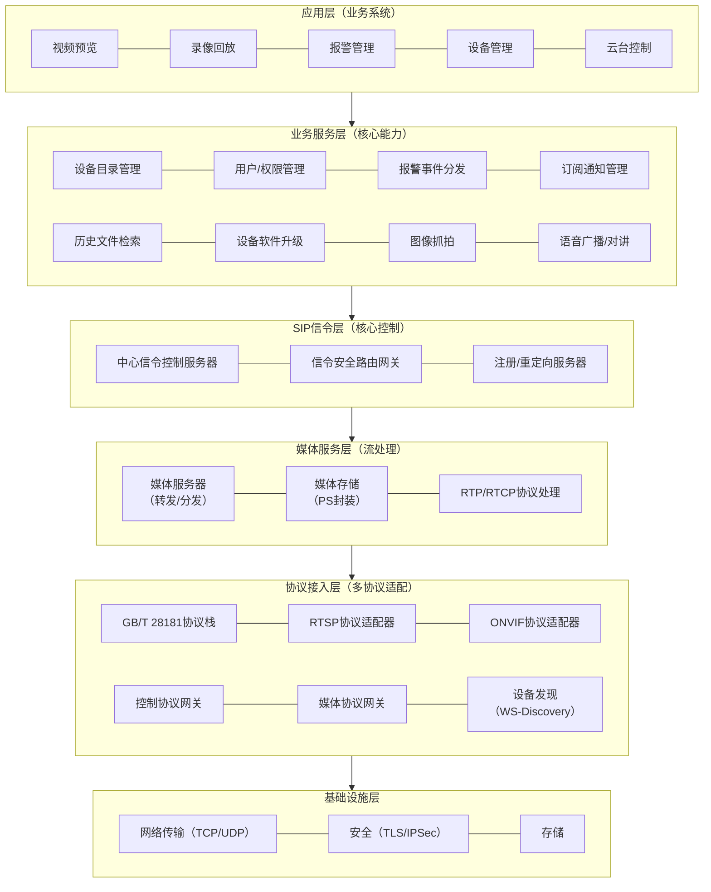

```text
┌─────────────────────────────────────────────────────────────────┐
│                        应用层（业务系统）                        │
│           视频预览 │ 录像回放 │ 报警管理 │ 设备管理 │ 云台控制     │
├─────────────────────────────────────────────────────────────────┤
│                     业务服务层（核心能力）                       │
│   设备目录管理 │ 用户/权限管理 │ 报警事件分发 │ 订阅通知管理      │
│   历史文件检索 │ 设备软件升级 │ 图像抓拍 │ 语音广播/对讲        │
├─────────────────────────────────────────────────────────────────┤
│                     SIP信令层（核心控制）                        │
│  ┌──────────────┐ ┌──────────────┐ ┌──────────────┐           │
│  │ 中心信令控制  │ │ 信令安全路由  │ │ 注册/重定向  │           │
│  │   服务器      │ │   网关       │ │   服务器     │           │
│  └──────────────┘ └──────────────┘ └──────────────┘           │
├─────────────────────────────────────────────────────────────────┤
│                     媒体服务层（流处理）                         │
│  ┌──────────────┐ ┌──────────────┐ ┌──────────────┐           │
│  │  媒体服务器   │ │  媒体存储    │ │  RTP/RTCP   │           │
│  │  (转发/分发)  │ │  (PS封装)   │ │  协议处理    │           │
│  └──────────────┘ └──────────────┘ └──────────────┘           │
├─────────────────────────────────────────────────────────────────┤
│                  协议接入层（多协议适配）                        │
│  ┌──────────────┐ ┌──────────────┐ ┌──────────────┐           │
│  │ GB/T 28181  │ │  RTSP协议   │ │  ONVIF协议  │           │
│  │  协议栈      │ │   适配器    │ │   适配器    │           │
│  └──────────────┘ └──────────────┘ └──────────────┘           │
│  ┌──────────────┐ ┌──────────────┐ ┌──────────────┐           │
│  │  控制协议    │ │  媒体协议    │ │  设备发现    │           │
│  │   网关       │ │   网关       │ │  (WS-Discovery)│         │
│  └──────────────┘ └──────────────┘ └──────────────┘           │
├─────────────────────────────────────────────────────────────────┤
│                      基础设施层                                 │
│           网络传输（TCP/UDP） │ 安全（TLS/IPSec） │ 存储         │
└─────────────────────────────────────────────────────────────────┘
```


