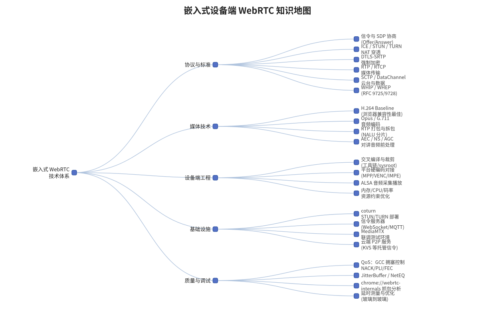
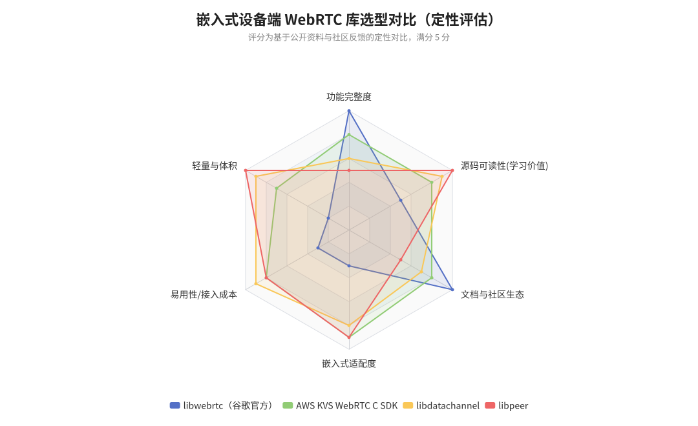
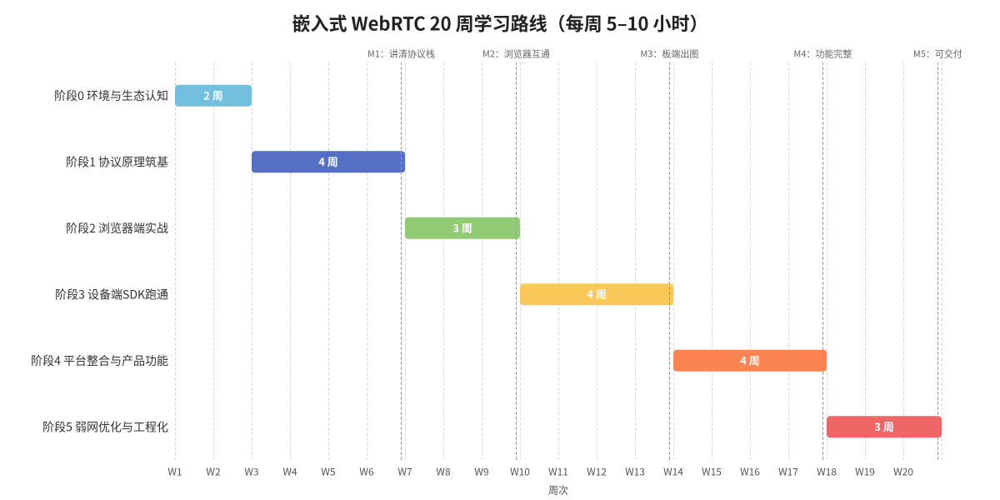

# 嵌入式设备端 WebRTC 系统学习规划
## —— 面向瑞芯微 / 君正 / 海思平台开发者的 20 周实战路线

> **计划参数**：学习目标＝嵌入式设备端 WebRTC（IPC 方向：低延时预览 + 双向语音对讲 + 数据通道控制）；时间预算＝每周 5–10 小时，总周期约 **20 周（4.5–5 个月）**；已有基础＝C/C++、Linux 网络编程、平台 SDK 与交叉编译；需补齐＝音视频编解码概念、流媒体协议、少量 JavaScript。

---

## TL;DR（计划摘要）

整个学习分为 **6 个阶段、5 个里程碑**：W1–2 生态与环境 → W3–6 协议原理筑基 → W7–9 浏览器端实战（顺带补 JS）→ W10–13 设备端 SDK 跑通（**核心里程碑：开发板推流、浏览器出图**）→ W14–17 平台硬编码整合与产品化功能 → W18–20 弱网优化与工程化交付。技术主线建议采用 **AWS KVS WebRTC C SDK 作为主力学习库**（嵌入式证据链最完整、文档最友好），以 **libdatachannel / libpeer 作为协议源码阅读素材**，**GStreamer webrtcbin 作为快速验证工具**，而谷歌官方 libwebrtc 仅作进阶选读——它的体量（Windows Release 构建约 600MB、数百个依赖）对嵌入式入门是严重负担 [(tensorworks.com.au)](https://tensorworks.com.au/blog/a-brief-comparison-of-libdatachannel-and-libwebrtc/) 。最终交付物是一个跑在你手头开发板上的完整 Demo：**平台硬编 H.264 + Opus/G.711 音频 + DataChannel 云台控制 + 浏览器低延时预览与对讲**，局域网延时目标 100–300ms，并具备 STUN/TURN 外网穿透能力。

---

## 1. 学习者画像与总体策略

### 1.1 你的优势与短板

作为在瑞芯微、君正、海思平台上干活的嵌入式开发者，你的核心优势恰好是 WebRTC 设备端开发中最难速成的那部分：**交叉编译、内核/驱动调试、V4L2/ALSA、平台媒体管线（MPP/VENC/IMP）、内存与性能抠优化**。已确认的 Linux 网络编程基础意味着 UDP socket、epoll、多线程这些 WebRTC 底层传输的承载技术你都已具备，ICE/STUN 这类协议对你来说就是"又一个 UDP 状态机"。

短板主要在三块：**音视频编解码概念**（H.264 的 NALU/SPS/PPS、GOP、无 B 帧要求，Opus 与 G.711 的差异）、**WebRTC 协议族本身**（SDP/ICE/DTLS/SRTP 这条链路与传统 RTSP/RTP 很不一样）、以及**少量前端知识**（只需学到能写一个信令客户端和播放页面即可，不必深入）。好消息是这些短板都有明确的边界——设备端 WebRTC 不需要你掌握 FFmpeg 全家桶，也不需要理解浏览器渲染管线，更不需要一上来就读 libwebrtc 那几百万行源码。

### 1.2 总体策略：项目驱动、先跑通再深挖、单点突破

本计划采用"**自顶向下跑通链路、自底向上理解原理**"的双向策略。具体来说：先用现成的嵌入式 SDK（KVS C SDK）在开发板上把"推流→浏览器播放"这条链路跑通，建立成就感和全局直觉；再回头带着"这行代码到底在干什么"的问题去读协议文档和轻量库源码；最后在产品化阶段把硬编码、对讲、云台、弱网优化逐项打穿。这与直接啃 libwebrtc 源码的路线相比，挫败感低一个数量级——后者光是 GN 构建系统和源码同步就能消耗掉你全部的前两周热情 [(博客园)](https://www.cnblogs.com/still-smile/p/18758012) 。

另一个重要策略是**以终为始地定义产出**。IPC 行业对 WebRTC 的需求非常具体：浏览器/App 无插件低延时预览（WebRTC 端到端延时通常在 500ms 以内，良好网络下可达 100ms 级别，远优于 RTSP 默认缓冲下的 0.5–2 秒） [(微信公众号(EI Viajero))](http://mp.weixin.qq.com/s?__biz=MzIwMjMyNzIzNw==&mid=2247484842&idx=1&sn=87995caac051a2be683497040bfd33e9) 、双向语音对讲、通过 DataChannel 实现的云台/参数控制、以及强制加密带来的安全性（WebRTC 全链路强制 DTLS-SRTP 加密） [(微信公众号(EI Viajero))](http://mp.weixin.qq.com/s?__biz=MzIwMjMyNzIzNw==&mid=2247484842&idx=1&sn=87995caac051a2be683497040bfd33e9) 。你的每个学习阶段都对应着这个终极目标的一个可验证子产出，避免"学了半天不知道能干什么"的悬空感。

---

## 2. 先看清全局：WebRTC 知识地图

### 2.1 技术体系总览

WebRTC 本质上不是一个单一协议，而是**一组既有协议与标准的组合拳**：信令与 SDP 协商负责"交换彼此能力"，ICE/STUN/TURN 负责"在 NAT 丛林中找到一条通路"，DTLS 负责"握手与密钥协商"，SRTP/SRTCP 负责"加密地搬运音视频 RTP 包"，SCTP/DataChannel 负责"捎带任意数据"，GCC/NACK/FEC/JitterBuffer 这一整套 QoS 机制负责"在烂网络下尽量流畅" [(火山引擎 ADG 社区)](https://adg.csdn.net/6970908d437a6b40336abc28.html) 。对嵌入式开发者而言，还要在此之上叠加设备端工程（交叉编译、硬编对接、资源约束）和基础设施（信令服务器、TURN 服务器、联调环境）两个维度。

上图把这套体系整理成了五大分支，它将是你未来 20 周的"作战地图"。需要特别指出的是设备端场景与会议场景的三个关键差异：**采集来源不同**（浏览器用 getUserMedia，你用 V4L2/MPP/IMPE）、**编码方式不同**（浏览器软编 VP8/H.264，你必须用平台硬编 H.264 才撑得住 1080p）、**信令通道不同**（会议产品多用 WebSocket，IPC 场景常见 MQTT、HTTP，甚至新兴的 WHIP 协议——一次 HTTP POST 即完成 SDP 交换，规范简单到"64KB 内存的嵌入式设备都能实现"） [(CallSphere)](https://callsphere.ai/blog/vw3e-webrtc-whip-ai-ingress-2026) 。

### 2.2 一次通话到底发生了什么

理解 WebRTC 最快的方式是跟踪一次完整的连接建立流程：双方先通过**信令通道**（标准不规定实现，WebSocket/MQTT/HTTP 均可）交换 SDP——Offer/Answer 模型描述各自支持的编解码器、传输候选与扩展能力；随后双方各自通过 STUN 收集 **ICE Candidate**（host/srflx/relay 三类地址）并互相交换，ICE 对所有候选对做连通性检查、选出最优路径；路径打通后在其上完成 **DTLS 握手**（交换证书指纹、协商密钥）；握手完成的那一刻起，媒体数据以 **SRTP** 加密包的形式开始流动，RTCP 反馈包则持续回报丢包、抖动与到达时间供拥塞控制使用 [(CSDN博客)](https://blog.csdn.net/gitblog_00173/article/details/151418694) 。

这条链路上有几个对嵌入式开发者特别反直觉的点。其一，**信令没有标准**——你可以用任何方式传 SDP，这也是 KVS 用自家 WebSocket 信令、而 WHIP 用单个 HTTP POST 都能成立的原因 [(CallSphere)](https://callsphere.ai/blog/vw3e-webrtc-whip-ai-ingress-2026) 。其二，**STUN 不是万能的**：公开数据显示 STUN 直连只能覆盖约 80–85% 的网络场景，剩余 15–20%（对称 NAT、严格企业防火墙）必须靠 TURN 中继兜底，只配 STUN 的生产系统会让一部分用户"静默连不上" [(Wowza)](https://www.wowza.com/blog/webrtc-best-practices-what-you-need-to-know-about-sdp-ice-whip-whep-and-stun-turn) 。其三，**加密不可关闭**——DTLS-SRTP 是强制的，这意味着你的设备端必须搞定 OpenSSL 或 mbedTLS 的交叉编译，这是嵌入式集成中最常见的构建坑之一 [(Github)](https://github.com/awslabs/amazon-kinesis-video-streams-webrtc-sdk-c) 。

---

## 3. 技术选型：嵌入式设备端 WebRTC 库怎么选

### 3.1 候选库全景与对比

设备端（非浏览器）实现 WebRTC 主要有五条技术路线，它们在体量、依赖、接入成本和生态上差异巨大。选型的核心矛盾是：**功能完整度与嵌入式资源约束之间的权衡**。谷歌 libwebrtc 功能最全（GCC 拥塞控制、NetEQ、AEC3 全套都有），但依赖数百个第三方库、构建系统（GN/Ninja/depot_tools）与嵌入式 Buildroot 体系格格不入，Windows 下一个 Release 构建就有约 600MB，而 libdatachannel 同样功能定位下只有约 20MB [(tensorworks.com.au)](https://tensorworks.com.au/blog/a-brief-comparison-of-libdatachannel-and-libwebrtc/) ；AWS KVS WebRTC C SDK 则是工业界在 IPC 设备上验证最多的方案，纯 C、官方支持交叉编译、信令/STUN/TURN 全托管 [(Github)](https://github.com/awslabs/amazon-kinesis-video-streams-webrtc-sdk-c) ；libpeer 是一个数千行规模的 C 实现，麻雀虽小五脏俱全（H.264/G.711/Opus、STUN/TURN、DataChannel，甚至内置 WHIP 与 MQTT 两种信令），是**阅读源码理解协议的最优素材** [(实时互动网)](https://www.nxrte.com/jishu/webrtc/62077.html) ；GStreamer webrtcbin 严格说不是库而是管线元件，但用它可以在十分钟内把摄像头流推到浏览器，是**验证链路与对拍的利器** [(fictionlab.pl)](https://fictionlab.pl/blog/webrtc-on-robots-how-to-stream-live-video-from-your-rover-to-any-browser/) 。

| 维度 | libwebrtc（谷歌） | AWS KVS WebRTC C SDK | libdatachannel | libpeer | GStreamer webrtcbin |
|---|---|---|---|---|---|
| 语言/形态 | C++ 巨型工程 | 纯 C，静态库 | C++17，CMake | 纯 C，数千行 | GStreamer 插件 |
| 编译体积 | 约 600MB（Release） [(tensorworks.com.au)](https://tensorworks.com.au/blog/a-brief-comparison-of-libdatachannel-and-libwebrtc/)  | 数 MB 级，支持全静态链接 [(Github)](https://github.com/awslabs/amazon-kinesis-video-streams-webrtc-sdk-c)  | 约 20MB [(博客园)](https://www.cnblogs.com/still-smile/p/18758012)  | 极小（ESP32 可跑） [(CSDN博客)](https://blog.csdn.net/gitblog_00095/article/details/155150646)  | 依赖 GStreamer 全家桶 |
| 交叉编译 | 困难（GN+sysroot+depot_tools） [(CSDN文库)](https://wenku.csdn.net/answer/3ig1nyokzy)  | 官方支持（CC/CXX 环境变量） [(Github)](https://github.com/awslabs/amazon-kinesis-video-streams-webrtc-sdk-c)  | 简单（CMake） [(博客园)](https://www.cnblogs.com/still-smile/p/18758012)  | 简单（CMake） [(Github)](https://github.com/aconchillo/libpeer.git)  | 取决于平台 GStreamer 支持 |
| 视频/音频编码 | H.264/VP8/VP9/AV1、Opus 全套 | H.264/VP8 + Opus/G.711 [(CSDN博客)](https://blog.csdn.net/awschina/article/details/126047300)  | 依赖外部编码器 | H.264 + G.711/Opus [(实时互动网)](https://www.nxrte.com/jishu/webrtc/62077.html)  | 任意 GStreamer 编码元件 |
| QoS（GCC/NACK/FEC） | 完整 | 基础（NACK/RTX 等） | 基础 | 极简 | 继承 libwebrtc（Gst 内置实现） |
| 信令 | 无（自行实现） | KVS 托管信令（WebSocket） [(amazonaws.cn)](https://docs.amazonaws.cn/kinesisvideostreams-webrtc-dg/latest/devguide/what-is-kvswebrtc.html)  | 无（自行实现） | WHIP / MQTT [(实时互动网)](https://www.nxrte.com/jishu/webrtc/62077.html)  | 无（自行实现） |
| 嵌入式落地证据 | 需重度裁剪 [(yhzz.com.cn)](https://www.yhzz.com.cn/a/12847.html)  | 君正平台 [(CSDN博客)](https://blog.csdn.net/Swallow_he/article/details/116587908) 、海思交叉编译 [(openEuler 社区)](https://openeuler.csdn.net/69ee27f754b52172bc7028a6.html) 、树莓派 [(实时互动网)](https://www.nxrte.com/jishu/webrtc/36651.html)  | RV1106 4G 场景 [(火山引擎 ADG 社区)](https://adg.csdn.net/695257425b9f5f31781b9ce2.html)  | ESP32/树莓派 [(Github)](https://github.com/aconchillo/libpeer.git)  | 机器人/ROS 场景 [(fictionlab.pl)](https://fictionlab.pl/blog/webrtc-on-robots-how-to-stream-live-video-from-your-rover-to-any-browser/)  |
| 学习价值 | 进阶（源码海洋） | 高（API 贴近标准流程） | 高（现代 C++ 范本） | **最高**（可读完全部） | 中（黑盒但出活快） |

### 3.2 本计划的选型结论

**主线：AWS KVS WebRTC C SDK。** 理由有三：第一，它是目前嵌入式 IPC 领域证据链最完整的方案——AWS 官方明确其 C 语言版本"适用于嵌入式设备" [(amazonaws.cn)](https://docs.amazonaws.cn/kinesisvideostreams-webrtc-dg/latest/devguide/what-is-kvswebrtc.html) ，社区有君正平台跑 master 端的真实案例 [(CSDN博客)](https://blog.csdn.net/Swallow_he/article/details/116587908) ，也有海思交叉编译工具链（arm-himix200-linux）的完整编译记录 [(openEuler 社区)](https://openeuler.csdn.net/69ee27f754b52172bc7028a6.html) ；第二，它把信令、STUN、TURN 全部托管，学习期你不用先搭一堆服务器就能看到画面，且其 Master/Viewer 模型（一个 Channel 一个 Master，最多 10 个 Viewer）天然契合"一台摄像头、多个手机看"的 IPC 形态 [(CSDN博客)](https://blog.csdn.net/awschina/article/details/126047300) ；第三，支持的编码集（H.264/VP8 视频、Opus/G.711 音频）与平台硬编能力精确对齐 [(CSDN博客)](https://blog.csdn.net/awschina/article/details/126047300) 。学习阶段用免费额度足够，后期若不想绑定 AWS，其代码本身也是理解"设备端 WebRTC Agent 该怎么写"的优质范本。

**辅线：libdatachannel + libpeer + webrtcbin。** libdatachannel 适合作为"去云化"的第二条腿——RV1106 上已有搭配自建 coturn 实现 4G 对称 NAT 下 99% 以上连接成功率、延时 300ms 以内的完整教程，说明它在瑞芯微低端平台上资源占用可控 [(火山引擎 ADG 社区)](https://adg.csdn.net/695257425b9f5f31781b9ce2.html) 。libpeer 用来读源码：它的依赖只有 mbedtls、libsrtp、usrsctp、cJSON、coreHTTP、coreMQTT 六个，协议栈分层清晰，一周之内可以通读 [(实时互动网)](https://www.nxrte.com/jishu/webrtc/62077.html) 。GStreamer webrtcbin 则作为"标准答案发生器"——当你自研链路出问题时，先用它推一路流验证浏览器端和网络没问题，能把排障范围缩小一半 [(fictionlab.pl)](https://fictionlab.pl/blog/webrtc-on-robots-how-to-stream-live-video-from-your-rover-to-any-browser/) 。至于 libwebrtc，放进进阶清单：海思 HI3516EV200 上确有团队裁剪移植成功——可执行程序仅 3MB 多、1080P30 下 CPU 占用约 6%、局域网延时 100–200ms——但这是"移植裁切版本"的专业级工作，不适合作为入门起点 [(yhzz.com.cn)](https://www.yhzz.com.cn/a/12847.html) 。

---

## 4. 20 周路线图总览

下图给出六个阶段的时间分布与五个里程碑。每周按 5–10 小时计算，全周期约 100–200 小时。里程碑的设定遵循"每个都必须能产生可演示的实物"原则——嵌入式学习的最大敌人不是难度，而是长时间没有正反馈。

| 里程碑 | 时间点 | 验收标准（可演示） |
|---|---|---|
| **M1：讲清协议栈** | W6 末 | 能对着一张时序图讲清 SDP/ICE/DTLS/SRTP 全流程；Wireshark 抓出并指认一次真实连接的 STUN/DTLS 包 |
| **M2：浏览器互通** | W9 末 | 自写信令服务器 + 两个浏览器页面完成视频通话与 DataChannel 消息，能用 webrtc-internals 解读关键指标 |
| **M3：板端出图** | W13 末 | 开发板运行 KVS master 推送摄像头实时流，浏览器 viewer 成功播放，局域网延时 <500ms |
| **M4：功能完整** | W17 末 | 硬编 H.264 + 音频对讲 + DataChannel 控制三功能合一；外网经 TURN 可连；720P/1080P 下 CPU 与内存占用有数据记录 |
| **M5：可交付** | W20 末 | 弱网（限带宽/丢包）下表现有量化报告；断线重连、看门狗、日志完备；输出完整技术文档与演示视频 |

时间上如果某阶段提前完成，**优先把富余时间投给阶段 3（设备端跑通）**——它是整条路线中不确定性最高的一段（交叉编译依赖地狱、平台 SDK 版本差异都可能吞掉额外时间）；反之如果阶段 3 超期，可以压缩阶段 5 中 AEC 等选做内容，主干不断。

---

## 5. 分阶段详细计划

### 5.1 阶段 0（W1–W2）：环境准备与生态认知

**目标**：把"战场"搭好，把"地图"看明白。这两周不写任何正式代码，任务是消除信息差——搞清楚 WebRTC 能解决什么、不能解决什么，以及你的开发环境是否齐备。很多人跳过这一步直接编译 SDK，结果在"到底该用哪个库、哪个服务器"上反复摇摆，反而浪费更多时间。

**环境与内容**：准备一台 Ubuntu 22.04 主机（或虚拟机/Docker）、一块手头的开发板（RV1106/RV1126、T31、Hi3516 任一即可）及其 SDK 交叉工具链、最新版 Chrome。阅读方面，先读《WebRTC for the Curious》中文版的前两章建立宏观认识 [(webrtcforthecurious.com)](https://webrtcforthecurious.com/zh/docs/01-what-why-and-how/) ，再浏览 walterfan 的《WebRTC 学习笔记》目录——这份持续更新的中文手册覆盖 API、信令、SDP、ICE/DTLS/SRTP、Opus/H.264、QoS 乃至源码分析，还自带一份 4 周学习路线，是全程的"字典式"参考 [(walterfan.github.io)](https://walterfan.github.io/webrtc_note/) 。同时做一件事：用浏览器打开任意一个 WebRTC 演示页面完成一次视频互通，并用 `chrome://webrtc-internals` 第一次看到 SDP 与 ICE 的原始数据，对这个工具建立第一印象 [(bloggeek.me)](https://bloggeek.me/webrtcglossary/webrtc-internals/) 。

[(walterfan.github.io)](https://walterfan.github.io/webrtc_note/) 

**产出与验收**：一台可用的构建主机 + 一份自己的环境清单文档；能用一页纸向同事讲清"WebRTC 与 RTSP/RTMP 的本质区别"（提示：UDP 优先、强制加密、浏览器原生、无 B 帧约束、亚秒级延时 [(微信公众号(EI Viajero))](http://mp.weixin.qq.com/s?__biz=MzIwMjMyNzIzNw==&mid=2247484842&idx=1&sn=87995caac051a2be683497040bfd33e9) ）。这两周的关键心态是克制——不要急着 clone 任何 SDK 源码。

### 5.2 阶段 1（W3–W6）：协议原理筑基

**目标**：协议原理是设备端开发的"内功"。嵌入式 WebRTC 工程师与"SDK 调用工程师"的分水岭，就在于能否读懂一条 SDP、能否解释为什么对称 NAT 下必须走 TURN、能否从 Wireshark 抓包里指出 DTLS 握手卡在哪一步。这四周决定你后续排障的效率上限。

**学习内容（按周推进）**：W3 精读 SDP 与 Offer/Answer 模型——理解 m 行、a=rtpmap、a=fingerprint、a=candidate、a=ssrc 各自的含义，并对照 RTCPeerConnection 的 10 个核心 API 调用点（`addTrack`/`createOffer`/`setLocalDescription`/`addIceCandidate` 等）建立"API 与协议的映射" [(yuanchieh.page)](https://yuanchieh.page/posts/2021/2021-05-30-%E6%B7%B1%E5%BA%A6%E8%A7%A3%E6%9E%90-webrtc/) 。W4 主攻 ICE/STUN/TURN：候选者三类地址的生成过程、连通性检查（Binding Request/Response）、NAT 四种类型与打洞成功率的关系 [(CSDN博客)](https://blog.csdn.net/gitblog_00173/article/details/151418694) 。W5 主攻安全与传输：DTLS 握手流程（与 TLS 的异同、自签名证书+指纹校验模式）、SRTP 密钥如何从 DTLS 导出、RTP/RTCP 包头结构（seq/timestamp/SSRC/M 位）与 RTCP SR/RR 报告 [(CSDN博客)](https://blog.csdn.net/gitblog_00173/article/details/151418694) 。W6 收尾 DataChannel（SCTP over DTLS）与 QoS 入门：GCC 拥塞控制的"基于丢包"与"基于延时"双控制器思想——丢包率低于 2% 加带宽、2–10% 保持、超过 10% 降带宽，最终取两者估计的最小值 [(webrtcforthecurious.com)](https://webrtcforthecurious.com/zh/docs/06-media-communication/) 。

**实战任务（每周一个）**：W3 用文本工具手工"解剖"一份真实 SDP；W4 打开 trickle-ice 测试页，观察 host/srflx/relay 候选的收集过程并尝试添加一个自建 STUN 条目 [(微信公众号(复现智能))](http://mp.weixin.qq.com/s?__biz=MzkxNjcyMzc3OQ==&mid=2247485048&idx=1&sn=a6ecafbf70bea25f5c0b6e916b005ddb) ；W5 用 Wireshark 抓取一次浏览器 WebRTC 通话，过滤 `stun || dtls`，逐包对照协议文档；W6 写一篇给自己看的《一次 WebRTC 连接建立时序分析》笔记。音视频基础穿插进行：理解 H.264 的 NALU 结构、SPS/PPS/IDR 概念、为什么 WebRTC 场景要求编码器**禁用 B 帧**（浏览器不支持带 B 帧的 H.264 流，MediaMTX 等服务器会直接报错） [(IRZU INSTITUTE)](https://irzu.org/research/ffmpeg-creating-an-rtsp-stream-and-converting-it-to-webrtc-using-mediamtx/) 、GOP 与延时的关系；音频侧搞清采样率/帧长（Opus 常用 48kHz/20ms 帧、G.711 为 8kHz 窄带）——这些是你把平台硬编输出"喂"给 WebRTC 时不可回避的概念 [(CSDN博客)](https://blog.csdn.net/awschina/article/details/126047300) 。

**产出与验收（M1）**：协议笔记一组 + 能脱稿讲清连接建立全流程。推荐资源：《WebRTC for the Curious》中文版协议章节 [(webrtcforthecurious.com)](https://webrtcforthecurious.com/zh/docs/01-what-why-and-how/) 、walterfan 笔记的传输篇 [(walterfan.github.io)](https://walterfan.github.io/webrtc_note/) 、以及李超《WebRTC 音视频实时互动技术：原理、实战与源码分析》——这本书 272 页、讲解系统全面，适合此阶段建立框架，但社区评价其对 JitterBuffer/NetEq 等着墨较少，不必深究后段源码章节 [(CSDN博客)](https://blog.csdn.net/hzbooks/article/details/119745946) 。

### 5.3 阶段 2（W7–W9）：浏览器端实战（顺带补 JS）

**目标**：从"懂协议"到"会写链路"。虽然你的主战场是设备端，但浏览器是 IPC 场景的天然播放端与调试端——**先在纯浏览器环境里完成一次"信令服务器 + 双方 PeerConnection"的完整实现**，等于用最低成本把阶段 1 的协议知识全部操练一遍。这一步产出的一对一通话 Demo，同时就是你后续设备端联调时的"标准对端"。

**学习内容与实战**：JavaScript 只需速成到能读能写异步代码（Promise/async-await）与 DOM 操作即可，不必系统学前端。W7 完成 MDN WebRTC 指南的核心章节并实现本地摄像头采集预览；W8 参照成熟的 socket.io 信令教程（房间管理、消息转发、加入/离开/满员逻辑，代码量约百行）搭建自己的信令服务器，完成两个浏览器标签页之间的视频通话 [(简书)](https://www.jianshu.com/p/ec13687e0506) ；W9 给这个 Demo 加上 DataChannel 文字消息功能，并用 webrtc-internals 做一次完整复盘——观察 ICE 状态机流转（checking→connected→completed）、找到最终选中的 candidate pair、读懂 bitrate/jitter/packetsLost 曲线 [(bloggeek.me)](https://bloggeek.me/webrtcglossary/webrtc-internals/) 。

**产出与验收（M2）**：信令服务器源码 + 通话页面 + 一份 webrtc-internals 指标解读笔记。这个 Demo 请妥善保存并持续维护：阶段 3 起你的开发板将取代其中一个浏览器成为对端，信令消息格式保持一致能省下大量联调时间。有余力者可在此阶段把信令传输从 socket.io 换成裸 WebSocket 或 MQTT，为设备端（C 语言环境里没有 socket.io 这样方便的库）提前做好协议简化的心理准备——KVS 的嵌入式信令也是基于 WebSocket 承载 JSON 消息 [(CSDN博客)](https://blog.csdn.net/awschina/article/details/126047300) 。

### 5.4 阶段 3（W10–W13）：设备端 SDK 跑通——本路线最核心阶段

**目标**：让开发板第一次把实时画面推到浏览器。这是整个计划中工程量最大、坑最多、也最有成就感的阶段，拆成"**先在 x86 主机上跑通 → 再交叉编译上板 → 最后换成真实摄像头源**"三步走，每一步都有明确的退路，绝不把多个未知数混在一起调试。

**W10：x86 主机跑通官方 Sample。** 按官方流程编译 amazon-kinesis-video-streams-webrtc-sdk-c（依赖 libssl、libcurl、liblog4cplus、GStreamer 开发包），运行 `kvsWebrtcClientMaster` 与 `kvsWebrtcClientMasterGstSample`（后者通过 GStreamer 采集测试源或摄像头推流），浏览器端用 AWS 官方 JS 测试页作 viewer [(实时互动网)](https://www.nxrte.com/jishu/webrtc/36651.html) 。这一步刻意使用 AWS 托管信令，把变量压缩到最少；同时通读 Samples 目录代码，理解 `createSampleConfiguration` → 信令连接 → `createPeerConnection` → `addTrack` → 回调里送帧的完整骨架 [(码农家园)](https://www.codenong.com/c027d501e549f8ddc5c8/) 。

**W11–W12：交叉编译上板。** 这是嵌入式功力发挥的地方。SDK 官方支持以 `CC`/`CXX` 环境变量指定交叉工具链，并需正确设置 `BUILD_OPENSSL_PLATFORM`、`BUILD_LIBSRTP_HOST_PLATFORM`、`BUILD_LIBSRTP_DESTINATION_PLATFORM` 等参数；依赖版本有明确约束（OpenSSL 1.1.1x、libsrtp2 ≤2.5.0、usrsctp ≤0.9.5.0、libwebsockets ≥4.2.0，或 mbedTLS 2.25–3.x 替代 OpenSSL），建议开启 `BUILD_STATIC_LIBS=TRUE` 做全静态链接以规避板上动态库地狱 [(Github)](https://github.com/awslabs/amazon-kinesis-video-streams-webrtc-sdk-c) 。参考海思平台的实战记录：libwebsockets 需要单独交叉编译并关掉 server/testapps 等无用组件，openssl 也要先行交叉构建 [(openEuler 社区)](https://openeuler.csdn.net/69ee27f754b52172bc7028a6.html) 。君正 T31 这类内存紧张的平台，建议裁剪掉 GStreamer 相关 Sample（只保留核心库 + 自写送帧代码），君正平台跑 master 的社区案例已验证可行性 [(CSDN博客)](https://blog.csdn.net/Swallow_he/article/details/116587908) 。

**W13：接入真实视频源。** 先用最简单的路径：瑞芯微平台用 V4L2 直接抓 USB 摄像头或走 MPP 的 VI→VENC 通路拿到 H.264 码流（RV1106 上 VI/VPSS/VENC 绑定与多路编码是成熟用法，多路受 CMA 内存限制 [(luckfox.com)](https://forums.luckfox.com/viewtopic.php?t=914) ），把 Sample 里 GStreamer 测试源替换为你的帧回调——核心工作就是把硬编输出的 Annex-B H.264 帧按 NALU 切分、打上 90kHz 时钟基的 RTP 时间戳送进去。音频可暂缓，先保证视频链路。**验收（M3）**：板端推流、浏览器出图、秒表法实测局域网延时（摄像头对着在线秒表拍，画面差值即延时，社区惯用此法 [(CSDN博客)](https://blog.csdn.net/Marvin1311/article/details/139169450) ），目标 <500ms。若时间充裕，同一周用 GStreamer webrtcbin 在板上再推一路做交叉验证 [(fictionlab.pl)](https://fictionlab.pl/blog/webrtc-on-robots-how-to-stream-live-video-from-your-rover-to-any-browser/) 。

### 5.5 阶段 4（W14–W17）：平台整合与产品化功能

**目标**：把"能跑"变成"像个产品"。这四周围绕 IPC 真实需求逐项叠加功能：**硬编码全替代、双向语音对讲、DataChannel 控制、外网 TURN 穿透**。同时开始记录资源占用数据（CPU/内存/码率），为阶段 5 的优化建立基线。

**W14 视频硬编整合深化**：把送帧路径完全切换到平台硬编——瑞芯微 MPP VENC（注意 RV1106/RV1103 智能编码方案在低码率场景的码率节省特性，以及 GOP/码率控制对弱网的影响） [(雪球)](https://xueqiu.com/S/SH603893/253297019) 、君正 IMP Encoder、海思 VENC。关键参数：分辨率/帧率按需、**关闭 B 帧** [(IRZU INSTITUTE)](https://irzu.org/research/ffmpeg-creating-an-rtsp-stream-and-converting-it-to-webrtc-using-mediamtx/) 、GOP 建议 1–2 秒（兼顾首屏与带宽）、码率先给保守值（720P 约 1–1.5Mbps）。**W15 音频链路**：ALSA 采集麦克风 → 编码（先 G.711 A-law/μ-law 跑通——8kHz 窄带、实现最简，KVS 与海思裁剪方案都支持它 [(CSDN博客)](https://blog.csdn.net/awschina/article/details/126047300) ；再换 Opus 48kHz 获得宽带音质）→ 随视频轨一起发送；反向实现浏览器端麦克风 → 设备端喇叭播放，完成双向对讲。**W16 数据与控制**：用 DataChannel 实现云台转动、IRCUT 切换、参数查询等控制消息（JSON 文本即可），这是 WebRTC 相对 RTSP 的原生优势项 [(微信公众号(EI Viajero))](http://mp.weixin.qq.com/s?__biz=MzIwMjMyNzIzNw==&mid=2247484842&idx=1&sn=87995caac051a2be683497040bfd33e9) ；有余力可调研 WebRTC AEC（回声消除）在 ARM 上的移植——这是对讲体验的硬骨头，AEC3 的 MIPS 消耗与定点化/NEON 优化都有公开工程讨论 [(DevPress官方社区)](https://devpress.csdn.net/avi/697cf496a16c6648a98649b8.html) ，低阶平台可以先靠半双工对讲（按键说话）规避。**W17 外网穿透**：在云服务器部署 coturn（Docker 一行起步，开放 3478 与中继端口段 49152–65535） [(CSDN博客)](https://blog.csdn.net/gitblog_00541/article/details/152429510) ，设备端与浏览器端都配上 STUN+TURN 双条目，用 trickle-ice 页面确认 srflx 与 relay 候选都能收集 [(微信公众号(复现智能))](http://mp.weixin.qq.com/s?__biz=MzkxNjcyMzc3OQ==&mid=2247485048&idx=1&sn=a6ecafbf70bea25f5c0b6e916b005ddb) ，再在 4G 热点环境下实测——参考 RV1106 的成熟教程，对称型 NAT 下 TURN 中继可做到 99% 以上连接成功率、300ms 以内延时 [(火山引擎 ADG 社区)](https://adg.csdn.net/695257425b9f5f31781b9ce2.html) 。

**产出与验收（M4）**：三功能合一的固件级 Demo + 外网可连 + 资源占用基线表（不同分辨率/码率下的 CPU、内存、码率）。本周起养成习惯：每次功能变更都用 webrtc-internals 记录 RTCStats 快照，这对阶段 5 的弱网分析是重要资产 [(稀土掘金)](https://juejin.cn/post/7022909301035368456) 。

### 5.6 阶段 5（W18–W20）：弱网优化与工程化交付

**目标**：把 Demo 打磨成"敢给客户看"的东西。IPC 产品的真实网络环境（家用 Wi-Fi 穿墙、4G 弱信号、跨省跨运营商）远比实验室恶劣，最后三周聚焦**弱网表现量化、稳定性加固、文档化交付**。

**W18 弱网专题**：在主机侧用 `tc netem` 人为制造限速、丢包（5%/10%/20%）、抖动环境，观察画面劣化曲线并记录数据。理论侧补齐 GCC 深入机制：基于延时的估计器如何通过包组到达间隔（inter-arrival time）与 AIMD 原则工作、带宽探测（Probing）为什么存在——保守的 AIMD 在网络恢复后爬升很慢，探测簇以高于当前估计的速率短时发包来主动试探链路容量 [(微信公众号(关键帧Keyframe))](http://mp.weixin.qq.com/s?__biz=MjM5MTkxOTQyMQ==&mid=2257492900&idx=1&sn=0280dc87ed7b5f74aa3457a98dbba813) ；以及 NACK 重传与 FEC 的配合策略（重复请求间隔要大于 RTT、重传带宽计入总预算等工程细节） [(博客园)](https://www.cnblogs.com/WillingCPP/p/16807167.html) 。实践中你能直接调的手段其实不多但有效：码率上限、GOP 长度、分辨率降档策略、关键帧请求（PLI/FIR）响应——把这些做成可配置项。**W19 稳定性加固**：断网自动重连与 ICE restart、看门狗、内存泄漏审计（长跑 24–72 小时，`ENABLE_STATS_CALCULATION_CONTROL` 等运行时开关也可纳入压测 [(Github)](https://github.com/awslabs/amazon-kinesis-video-streams-webrtc-sdk-c) ）、启动时间优化。**W20 文档与交付**：整理《方案架构文档 + API 说明 + 移植指南 + 测试报告》，录制演示视频；同时把 MediaMTX 引入作为对照环境——它能把你板端/摄像头的 RTSP 流转成 WebRTC（内置 WHIP/WHEP，浏览器访问 `http://ip:8889/流名` 即播），用它验证"我的自研链路"与"成熟服务器链路"的表现差异，是交付前极好的交叉验证手段 [(博客园)](https://www.cnblogs.com/firsthelloworld/p/18819106) 。

**产出与验收（M5）**：量化测试报告（不同网络条件下的延时、卡顿率、恢复时间）+ 工程化固件 + 全套文档。至此你已完成"从零到能交付嵌入式 WebRTC 方案"的闭环——这套能力在 IPC、门铃、机器人、车载等低延时场景是直接可迁移的 [(fictionlab.pl)](https://fictionlab.pl/blog/webrtc-on-robots-how-to-stream-live-video-from-your-rover-to-any-browser/) 。

---

## 6. 三大平台落地要点速查

### 6.1 平台差异一览

三个平台的 WebRTC 集成思路完全一致（**硬编 H.264 帧回调 → WebRTC 送帧线程；ALSA 音频 → 编码 → 音频轨**），差异在于媒体管线的 API 形态与资源预算。下表汇总关键事实，供你按手头平台对号入座：

| 平台                                        | 媒体管线                                | 硬编对接要点                                                                                                                                                                                                 | 资源约束特征                                                                                                                   | WebRTC 生态证据                                                                                                                                                                                                                                                               |
| ----------------------------------------- | ----------------------------------- | ------------------------------------------------------------------------------------------------------------------------------------------------------------------------------------------------------ | ------------------------------------------------------------------------------------------------------------------------ | ------------------------------------------------------------------------------------------------------------------------------------------------------------------------------------------------------------------------------------------------------------------------- |
| 瑞芯微（RV1106 RV1126 RK356x RK3588） | MPP（VI→VPSS→VENC）或 V4L2+MPP         | VENC 通道绑定、CMA 内存决定多路能力 [(luckfox.com)](https://forums.luckfox.com/viewtopic.php?t=914) ；RV1106 可绕开 Rockit 用 V4L2+MPP 直接采集编码 [(CSDN博客)](https://blog.csdn.net/weixin_33701617/article/details/94476948) | 视觉系列内存中等；RK3568 跑多路 WebRTC 服务器侧转码会把 CPU 占满，说明应坚持"设备端只做硬编+封包" [(博客园)](https://www.cnblogs.com/firsthelloworld/p/18819106) | libdatachannel+coturn 在 RV1106 4G 场景有完整教程 [(火山引擎 ADG 社区)](https://adg.csdn.net/695257425b9f5f31781b9ce2.html)                                                                                                                                                             |
| 君正（T31/T40）                               | IMP（IMP_FrameSource→IMP_Encoder）    | 内存紧张（常见 64MB 级），建议裁剪 SDK、关闭 GStreamer 组件、音频先用 G.711                                                                                                                                                    | 三平台中资源最紧；优先选 KVS C SDK 精简版或 libpeer 级方案                                                                                  | KVS master 已在君正平台跑通 [(CSDN博客)](https://blog.csdn.net/Swallow_he/article/details/116587908) ；Thingino 开源固件（支持 T10–T31、300+ 机型）可借鉴其 sensor/音频/双码流工程组织 [(akbwe.com)](https://akbwe.com/posts/truly-opensource-ipc-firmware-thingnino-and-replacing-wifi6-module-aic8800d40/) |
| 海思 （Hi3516 Hi3519 等）                | MPP（VI→VENC），arm-himix200-linux 工具链 | KVS 依赖需逐个交叉编译（openssl、libwebsockets 关 server/testapps） [(openEuler 社区)](https://openeuler.csdn.net/69ee27f754b52172bc7028a6.html)                                                                      | 算力与内存介于两者之间                                                                                                              | HI3516EV200 裁剪版 WebRTC：可执行程序 3MB+、1080P30 CPU 约 6%、局域网 100–200ms、H.264 预览+G.711U 双向语音 [(yhzz.com.cn)](https://www.yhzz.com.cn/a/12847.html)                                                                                                                               |

### 6.2 跨平台通用原则

无论哪个平台，有四条原则是通用的。**第一，设备端绝不做软编**：1080P 软编在任何 IPC 级 SoC 上都会吃掉大半 CPU，硬编是唯一出路，海思案例 1080P30 仅 6% CPU 正是硬编+轻量协议栈组合的效果 [(yhzz.com.cn)](https://www.yhzz.com.cn/a/12847.html) 。**第二，编码参数向 WebRTC 妥协**：关 B 帧 [(IRZU INSTITUTE)](https://irzu.org/research/ffmpeg-creating-an-rtsp-stream-and-converting-it-to-webrtc-using-mediamtx/) 、GOP 收紧到 1–2 秒、SPS/PPS 周期性重发（防止观众中途加入花屏）、输出格式保持 Annex-B 并按 NALU 分包。**第三，音频先行用 G.711 跑通再升级 Opus**：G.711 无编码器依赖、逐字节可查，是排除"音频链路到底通没通"的最小变量方案 [(CSDN博客)](https://blog.csdn.net/awschina/article/details/126047300) 。**第四，时间戳纪律**：视频 90kHz、音频 8k/48k 时钟基，帧间隔不均匀时以采集时刻为准而非发送时刻——时间戳错误引发的 JitterBuffer 异常是最难排查的隐性 bug 之一。

开源固件生态也值得长期关注：君正阵营的 Thingino（完全开源、专注 Ingenic，支持 T10–T31 全系与 300 余款量产机型，双码流 H.264/H.265 RTSP、ONVIF、MQTT 一应俱全） [(akbwe.com)](https://akbwe.com/posts/truly-opensource-ipc-firmware-thingnino-and-replacing-wifi6-module-aic8800d40/) 和跨平台的 OpenIPC（Buildroot 体系、T31 有专门配置） [(CSDN博客)](https://blog.csdn.net/gitblog_00167/article/details/160207310) 虽然目前都未内置 WebRTC 推流，但它们的图像调优、日夜切换、云台控制等工程代码是极佳参照，未来把你的 WebRTC 模块移植进这类固件也是一条现实的工程路径。

---

## 7. 基础设施与联调环境

### 7.1 信令：从"能通"到"合适"

信令是 WebRTC 标准刻意留白的一环，设备端有三条路线。**托管路线**（KVS 信令）：零服务器成本、自带 STUN/TURN，学习期首选 [(amazonaws.cn)](https://docs.amazonaws.cn/kinesisvideostreams-webrtc-dg/latest/devguide/what-is-kvswebrtc.html) 。**自建路线**：WebSocket + JSON（阶段 2 的 socket.io Demo 即雏形 [(简书)](https://www.jianshu.com/p/ec13687e0506) ）或 MQTT（IPC 行业常用，libpeer 直接内置 MQTT 信令支持 [(实时互动网)](https://www.nxrte.com/jishu/webrtc/62077.html) ），适合量产时与自家设备云打通。**标准化路线**：WHIP（WebRTC-HTTP Ingestion Protocol）已于 2025 年 3 月正式成为 RFC 9725，把信令压缩为"POST 一个 SDP Offer、收回一个 Answer、DELETE 结束会话"三个 HTTP 动作，OBS 30+、FFmpeg、主流 SFU（LiveKit、mediasoup、Janus、Cloudflare Realtime）均已支持，其规范简单到嵌入式设备也能轻松实现 [(Ant Media)](https://antmedia.io/streaming-protocols/) ；播放侧的 WHEP（RFC 9728）生态也已铺开（MediaMTX、Janus、LiveKit、Dolby Millicast 等），尽管 IETF 草案流程尚未走完 [(Fora Soft)](https://www.forasoft.com/learn/video-streaming/articles-streaming/whep-webrtc-egress) 。对 IPC 设备而言，"WHIP 推流 + 服务器侧分发"是近两年值得关注的新架构。

### 7.2 STUN/TURN 与联调工具链

自建 coturn 是必修课：apt 或 Docker 一行安装，核心配置是 `external-ip`（公网/内网映射）、`lt-cred-mech` 长期凭证、`min-port/max-port` 中继段，云服务器安全组务必放行 3478（UDP/TCP）与 49152–65535/UDP [(CSDN博客)](https://blog.csdn.net/gitblog_00541/article/details/152429510) 。搭好后用官方 trickle-ice 页面验证——看到 srflx 说明 STUN 正常、看到 relay 说明 TURN 正常 [(微信公众号(复现智能))](http://mp.weixin.qq.com/s?__biz=MzkxNjcyMzc3OQ==&mid=2247485048&idx=1&sn=a6ecafbf70bea25f5c0b6e916b005ddb) ；coturn 自带 `turnutils_uclient` 可做命令行压测，单 CPU 可承载数千路 TURN 并发或数万路 STUN 查询 [(CSDN博客)](https://blog.csdn.net/gitblog_00541/article/details/152429510) 。

调试三板斧请贯穿全程：**chrome://webrtc-internals**（SDP、ICE 状态机、逐流统计曲线的总控台 [(bloggeek.me)](https://bloggeek.me/webrtcglossary/webrtc-internals/) ）、**Wireshark**（stun/dtls/rtp 过滤器，协议课实践工具）、**秒表法延时测量**（摄像头拍在线毫秒秒表，画面差即玻璃到玻璃延时，行业通用土法但有效 [(CSDN博客)](https://blog.csdn.net/Marvin1311/article/details/139169450) ）。此外，MediaMTX 作为"协议转换参考系"（RTSP/RTMP↔WebRTC、WHIP 推流、WHEP 播放、单文件零依赖）建议常备——联调时先确认"成熟服务器链路正常"，再查自研链路，能把排障范围立刻缩小一半 [(stable-learn.com)](https://stable-learn.com/zh/mediamtx-streaming-server/) 。

---

## 8. 学习资源清单

| 类型 | 资源 | 用法建议 | 对应阶段 |
|---|---|---|---|
| 免费电子书 | 《WebRTC for the Curious》中文版 | 协议筑基主教材，逐章精读 [(webrtcforthecurious.com)](https://webrtcforthecurious.com/zh/docs/01-what-why-and-how/)  | 1 |
| 在线手册 | walterfan《WebRTC 学习笔记》 | 全程字典：API/协议/编解码/QoS/源码/工具，含 4 周路线 [(walterfan.github.io)](https://walterfan.github.io/webrtc_note/)  | 全程 |
| 纸质书 | 李超《WebRTC 音视频实时互动技术：原理、实战与源码分析》 | 框架建立快；JitterBuffer/NetEq 着墨少，源码章选读 [(CSDN博客)](https://blog.csdn.net/hzbooks/article/details/119745946)  | 1–2 |
| 视频课 | 李超《音视频 WebRTC 实时互动直播技术入门与实战》（慕课网） | 与书配套，一对一通话实战章节对阶段 2 帮助直接 [(Github)](https://github.com/Eished/notes/blob/master/%E9%9F%B3%E8%A7%86%E9%A2%91WebRTC%E5%AE%9E%E6%97%B6%E4%BA%92%E5%8A%A8%E7%9B%B4%E6%92%AD%E6%8A%80%E6%9C%AF%E5%85%A5%E9%97%A8%E4%B8%8E%E5%AE%9E%E6%88%98.md)  | 2 |
| 官方示例 | webrtc.github.io/samples、appr.tc | 阶段 2 对照实现；trickle-ice 页测 STUN/TURN [(微信公众号(复现智能))](http://mp.weixin.qq.com/s?__biz=MzkxNjcyMzc3OQ==&mid=2247485048&idx=1&sn=a6ecafbf70bea25f5c0b6e916b005ddb)  | 2、4 |
| SDK 文档 | amazon-kinesis-video-streams-webrtc-sdk-c（GitHub） | 交叉编译参数、依赖版本、CMake 开关以官方 README 为准 [(Github)](https://github.com/awslabs/amazon-kinesis-video-streams-webrtc-sdk-c)  | 3–5 |
| 源码精读 | sepfy/libpeer | 数千行 C 实现，协议栈最小全集，一周通读 [(实时互动网)](https://www.nxrte.com/jishu/webrtc/62077.html)  | 3–4 |
| 服务器 | coturn（TURN/STUN）、MediaMTX（WHIP/WHEP/转换） | 穿透与联调环境 [(CSDN博客)](https://blog.csdn.net/gitblog_00541/article/details/152429510)  | 4–5 |
| 调试工具 | chrome://webrtc-internals、Wireshark、`tc netem` | 指标解读、抓包、弱网模拟 [(bloggeek.me)](https://bloggeek.me/webrtcglossary/webrtc-internals/)  | 全程 |
| 行业参考 | WHIP RFC 9725 / WHEP 生态、KVS 托管 P2P | 把握"标准化信令"与"托管 P2P"两条行业走向 [(Ant Media)](https://antmedia.io/streaming-protocols/)  | 5+ |

## 9. 常见坑与避坑指南

**编码侧**：浏览器 WebRTC 不支持带 B 帧的 H.264，服务器日志会直接报 "WebRTC doesn't support H264 streams with B-frames"，推流端务必关 B 帧并建议 Baseline/Main Profile [(IRZU INSTITUTE)](https://irzu.org/research/ffmpeg-creating-an-rtsp-stream-and-converting-it-to-webrtc-using-mediamtx/) ；H.265 在 WebRTC 中仅 Chrome 136+ 与 Safari 18+ 且依赖硬件能力，跨浏览器产品仍以 H.264 为准 [(Wowza)](https://www.wowza.com/blog/webrtc-best-practices-what-you-need-to-know-about-sdp-ice-whip-whep-and-stun-turn) 。**网络侧**：只配 STUN 会让对称 NAT/严格防火墙后的用户静默失败（STUN 覆盖约 80–85% 场景），生产必须 STUN+TURN 双配 [(Wowza)](https://www.wowza.com/blog/webrtc-best-practices-what-you-need-to-know-about-sdp-ice-whip-whep-and-stun-turn) ；4G 场景建议 TCP 候选也保留，部分基站对 UDP 不友好 [(火山引擎 ADG 社区)](https://adg.csdn.net/695257425b9f5f31781b9ce2.html) 。**集成侧**：不要一开始交叉编译 libwebrtc——GN 工具链与 sysroot 配置对嵌入式极不友好，且数百依赖易引发符号冲突 [(CSDN文库)](https://wenku.csdn.net/answer/3ig1nyokzy) ；OpenSSL/usrsctp/libsrtp 注意 KVS 官方版本约束 [(Github)](https://github.com/awslabs/amazon-kinesis-video-streams-webrtc-sdk-c) 。**音频侧**：双向对讲的回声问题在小腔体设备上会被放大（扬声器 THD 超 5% 时线性 AEC 的 ERLE 可掉 20dB 以上），低端平台建议先半双工，AEC3 移植（约 8–12 MIPS 的 NLP 消耗量级）留作专项 [(DevPress官方社区)](https://devpress.csdn.net/avi/697cf571a16c6648a9864a0c.html) 。**架构侧**：P2P 天然一对一，一台摄像头多人同时看要么靠 Master 多 Peer（KVS 单 Channel 上限 10 个 Viewer [(CSDN博客)](https://blog.csdn.net/awschina/article/details/126047300) ），要么上 SFU（mediasoup/Janus/LiveKit）做扇出 [(fictionlab.pl)](https://fictionlab.pl/blog/webrtc-on-robots-how-to-stream-live-video-from-your-rover-to-any-browser/) ——量产选型时这条直接决定服务器成本模型。

## 10. 验收标准与进阶方向

20 周结束时，用这张表自我验收：① 能脱稿画出连接建立全时序并指认对应代码位置；② 手头开发板完成"硬编视频 + 双向语音 + DataChannel 控制"三合一 Demo，局域网玻璃到玻璃延时稳定 <300ms（对照：海思裁剪方案 100–200ms [(yhzz.com.cn)](https://www.yhzz.com.cn/a/12847.html) 、机器人场景 LTE 150–300ms [(fictionlab.pl)](https://fictionlab.pl/blog/webrtc-on-robots-how-to-stream-live-video-from-your-rover-to-any-browser/) ）；③ 4G 热点 + TURN 下连接成功率 ≥95%；④ 有一份弱网量化报告（5%/10%/20% 丢包下的表现）；⑤ 代码具备断线重连与 72 小时长跑稳定性。全部达标，意味着你已经具备独立交付嵌入式 WebRTC 方案的能力。

进阶沿四个方向展开：**服务端维度**，学 LiveKit/Janus/mediasoup 等 SFU，把"一台设备多人看"做规模化，并跟踪 WHIP/WHEP 标准化带来的架构简化 [(Fora Soft)](https://www.forasoft.com/learn/video-streaming/articles-streaming/whep-webrtc-egress) ；**源码维度**，回头精读 libwebrtc 的 GCC、NetEQ、AEC3 模块，walterfan 笔记的源码篇可作地图 [(walterfan.github.io)](https://walterfan.github.io/webrtc_note/) ；**音频维度**，把 AEC/NS/AGC 在 ARM 上的移植优化做成专长（IPC 对讲差异化竞争力） [(DevPress官方社区)](https://devpress.csdn.net/avi/697cf496a16c6648a98649b8.html) ；**行业维度**，关注 WebRTC 与 AI 语音代理结合的新形态——"WHIP 入流 + SFU + AI Agent"已成为 2026 年前后的典型生产架构，而这正是嵌入式语音终端的下一个机会窗口 [(CallSphere)](https://callsphere.ai/blog/vw3e-webrtc-whip-ai-ingress-2026) 。

---

*本计划基于公开技术资料与社区实践整理，库版本、依赖约束与云服务政策请以各项目官方文档为准。*

 [(实时互动网)](https://www.nxrte.com/jishu/webrtc/36651.html) : https://www.nxrte.com/jishu/webrtc/36651.html
 [(微信公众号(EI Viajero))](http://mp.weixin.qq.com/s?__biz=MzIwMjMyNzIzNw==&mid=2247484842&idx=1&sn=87995caac051a2be683497040bfd33e9) : http://mp.weixin.qq.com/s?__biz=MzIwMjMyNzIzNw==&mid=2247484842&idx=1&sn=87995caac051a2be683497040bfd33e9
 [(码农家园)](https://www.codenong.com/c027d501e549f8ddc5c8/) : https://www.codenong.com/c027d501e549f8ddc5c8/
 [(CSDN博客)](https://blog.csdn.net/Swallow_he/article/details/116587908) : https://blog.csdn.net/Swallow_he/article/details/116587908
 [(jnexpert.com)](http://m.jnexpert.com/article/detail?id=3900) : http://m.jnexpert.com/article/detail?id=3900
 [(amazonaws.cn)](https://docs.amazonaws.cn/kinesisvideostreams-webrtc-dg/latest/devguide/what-is-kvswebrtc.html) : https://docs.amazonaws.cn/kinesisvideostreams-webrtc-dg/latest/devguide/what-is-kvswebrtc.html
 [(CSDN博客)](https://blog.csdn.net/awschina/article/details/126047300) : https://blog.csdn.net/awschina/article/details/126047300
 [(CSDN文库)](https://wenku.csdn.net/answer/3ig1nyokzy) : https://wenku.csdn.net/answer/3ig1nyokzy
 [(walterfan.github.io)](https://walterfan.github.io/webrtc_note/) : https://walterfan.github.io/webrtc_note/
 [(CSDN博客)](https://blog.csdn.net/gitblog_00173/article/details/151418694) : https://blog.csdn.net/gitblog_00173/article/details/151418694
 [(akbwe.com)](https://akbwe.com/posts/truly-opensource-ipc-firmware-thingnino-and-replacing-wifi6-module-aic8800d40/) : https://akbwe.com/posts/truly-opensource-ipc-firmware-thingnino-and-replacing-wifi6-module-aic8800d40/
 [(CSDN博客)](https://blog.csdn.net/gitblog_00167/article/details/160207310) : https://blog.csdn.net/gitblog_00167/article/details/160207310
 [(火山引擎 ADG 社区)](https://adg.csdn.net/6970908d437a6b40336abc28.html) : https://adg.csdn.net/6970908d437a6b40336abc28.html
 [(CSDN博客)](https://blog.csdn.net/qq_33391441/article/details/119666694) : https://blog.csdn.net/qq_33391441/article/details/119666694
 [(webrtcforthecurious.com)](https://webrtcforthecurious.com/zh/docs/01-what-why-and-how/) : https://webrtcforthecurious.com/zh/docs/01-what-why-and-how/
 [(稀土掘金)](http://juejin.cn/post/7081249820056223752) : http://juejin.cn/post/7081249820056223752
 [(Github)](https://github.com/themactep/thingino-firmware/blob/master/README.md) : https://github.com/themactep/thingino-firmware/blob/master/README.md
 [(CSDN博客)](https://blog.csdn.net/gitblog_00932/article/details/154813474) : https://blog.csdn.net/gitblog_00932/article/details/154813474
 [(yuanchieh.page)](https://yuanchieh.page/posts/2021/2021-05-30-%E6%B7%B1%E5%BA%A6%E8%A7%A3%E6%9E%90-webrtc/) : https://yuanchieh.page/posts/2021/2021-05-30-%E6%B7%B1%E5%BA%A6%E8%A7%A3%E6%9E%90-webrtc/
 [(fictionlab.pl)](https://fictionlab.pl/blog/webrtc-on-robots-how-to-stream-live-video-from-your-rover-to-any-browser/) : https://fictionlab.pl/blog/webrtc-on-robots-how-to-stream-live-video-from-your-rover-to-any-browser/
 [(Ant Media)](https://antmedia.io/streaming-protocols/) : https://antmedia.io/streaming-protocols/
 [(Wowza)](https://www.wowza.com/blog/webrtc-best-practices-what-you-need-to-know-about-sdp-ice-whip-whep-and-stun-turn) : https://www.wowza.com/blog/webrtc-best-practices-what-you-need-to-know-about-sdp-ice-whip-whep-and-stun-turn
 [(CSDN博客)](https://blog.csdn.net/gitblog_00095/article/details/155150646) : https://blog.csdn.net/gitblog_00095/article/details/155150646
 [(实时互动网)](https://www.nxrte.com/jishu/webrtc/62077.html) : https://www.nxrte.com/jishu/webrtc/62077.html
 [(Github)](https://github.com/aconchillo/libpeer.git) : https://github.com/aconchillo/libpeer.git
 [(python | DeepWiki)](https://deepwiki.com/sepfy/libpeer) : https://deepwiki.com/sepfy/libpeer
 [(Fora Soft)](https://www.forasoft.com/learn/video-streaming/articles-streaming/whep-webrtc-egress) : https://www.forasoft.com/learn/video-streaming/articles-streaming/whep-webrtc-egress
 [(博客园)](https://www.cnblogs.com/still-smile/p/18758012) : https://www.cnblogs.com/still-smile/p/18758012
 [(tensorworks.com.au)](https://tensorworks.com.au/blog/a-brief-comparison-of-libdatachannel-and-libwebrtc/) : https://tensorworks.com.au/blog/a-brief-comparison-of-libdatachannel-and-libwebrtc/
 [(CallSphere)](https://callsphere.ai/blog/vw3e-webrtc-whip-ai-ingress-2026) : https://callsphere.ai/blog/vw3e-webrtc-whip-ai-ingress-2026
 [(openEuler 社区)](https://openeuler.csdn.net/69ee27f754b52172bc7028a6.html) : https://openeuler.csdn.net/69ee27f754b52172bc7028a6.html
 [(luckfox.com)](https://forums.luckfox.com/viewtopic.php?t=914) : https://forums.luckfox.com/viewtopic.php?t=914
 [(CSDN博客)](https://blog.csdn.net/hzbooks/article/details/119745946) : https://blog.csdn.net/hzbooks/article/details/119745946
 [(yhzz.com.cn)](https://www.yhzz.com.cn/a/12847.html) : https://www.yhzz.com.cn/a/12847.html
 [(豆瓣)](https://m.douban.com/book/subject/35543112/comments) : https://m.douban.com/book/subject/35543112/comments
 [(Github)](https://github.com/awslabs/amazon-kinesis-video-streams-webrtc-sdk-c) : https://github.com/awslabs/amazon-kinesis-video-streams-webrtc-sdk-c
 [(雪球)](https://xueqiu.com/S/SH603893/253297019) : https://xueqiu.com/S/SH603893/253297019
 [(CSDN博客)](https://blog.csdn.net/Marvin1311/article/details/139169450) : https://blog.csdn.net/Marvin1311/article/details/139169450
 [(CSDN博客)](https://blog.csdn.net/weixin_33701617/article/details/94476948) : https://blog.csdn.net/weixin_33701617/article/details/94476948
 [(Github)](https://github.com/Eished/notes/blob/master/%E9%9F%B3%E8%A7%86%E9%A2%91WebRTC%E5%AE%9E%E6%97%B6%E4%BA%92%E5%8A%A8%E7%9B%B4%E6%92%AD%E6%8A%80%E6%9C%AF%E5%85%A5%E9%97%A8%E4%B8%8E%E5%AE%9E%E6%88%98.md) : https://github.com/Eished/notes/blob/master/%E9%9F%B3%E8%A7%86%E9%A2%91WebRTC%E5%AE%9E%E6%97%B6%E4%BA%92%E5%8A%A8%E7%9B%B4%E6%92%AD%E6%8A%80%E6%9C%AF%E5%85%A5%E9%97%A8%E4%B8%8E%E5%AE%9E%E6%88%98.md
 [(CSDN博客)](https://blog.csdn.net/gitblog_00541/article/details/152429510) : https://blog.csdn.net/gitblog_00541/article/details/152429510
 [(DevPress官方社区)](https://devpress.csdn.net/avi/697cf496a16c6648a98649b8.html) : https://devpress.csdn.net/avi/697cf496a16c6648a98649b8.html
 [(火山引擎 ADG 社区)](https://adg.csdn.net/695257425b9f5f31781b9ce2.html) : https://adg.csdn.net/695257425b9f5f31781b9ce2.html
 [(微信公众号(复现智能))](http://mp.weixin.qq.com/s?__biz=MzkxNjcyMzc3OQ==&mid=2247485048&idx=1&sn=a6ecafbf70bea25f5c0b6e916b005ddb) : http://mp.weixin.qq.com/s?__biz=MzkxNjcyMzc3OQ==&mid=2247485048&idx=1&sn=a6ecafbf70bea25f5c0b6e916b005ddb
 [(博客园)](https://www.cnblogs.com/firsthelloworld/p/18819106) : https://www.cnblogs.com/firsthelloworld/p/18819106
 [(DevPress官方社区)](https://devpress.csdn.net/avi/697cf571a16c6648a9864a0c.html) : https://devpress.csdn.net/avi/697cf571a16c6648a9864a0c.html
 [(实时互动网)](https://www.nxrte.com/jishu/webrtc/55819.html) : https://www.nxrte.com/jishu/webrtc/55819.html
 [(IRZU INSTITUTE)](https://irzu.org/research/ffmpeg-creating-an-rtsp-stream-and-converting-it-to-webrtc-using-mediamtx/) : https://irzu.org/research/ffmpeg-creating-an-rtsp-stream-and-converting-it-to-webrtc-using-mediamtx/
 [(stable-learn.com)](https://stable-learn.com/zh/mediamtx-streaming-server/) : https://stable-learn.com/zh/mediamtx-streaming-server/
 [(bloggeek.me)](https://bloggeek.me/webrtcglossary/webrtc-internals/) : https://bloggeek.me/webrtcglossary/webrtc-internals/
 [(微信公众号(关键帧Keyframe))](http://mp.weixin.qq.com/s?__biz=MjM5MTkxOTQyMQ==&mid=2257492900&idx=1&sn=0280dc87ed7b5f74aa3457a98dbba813) : http://mp.weixin.qq.com/s?__biz=MjM5MTkxOTQyMQ==&mid=2257492900&idx=1&sn=0280dc87ed7b5f74aa3457a98dbba813
 [(实时互动网)](https://www.nxrte.com/jishu/webrtc/48157.html) : https://www.nxrte.com/jishu/webrtc/48157.html
 [(CSDN博客)](https://blog.csdn.net/qq_36083245/article/details/140032110) : https://blog.csdn.net/qq_36083245/article/details/140032110
 [(博客园)](https://www.cnblogs.com/rubyxie/articles/17014695.html) : https://www.cnblogs.com/rubyxie/articles/17014695.html
 [(博客园)](https://www.cnblogs.com/WillingCPP/p/16807167.html) : https://www.cnblogs.com/WillingCPP/p/16807167.html
 [(webrtcforthecurious.com)](https://webrtcforthecurious.com/zh/docs/06-media-communication/) : https://webrtcforthecurious.com/zh/docs/06-media-communication/
 [(稀土掘金)](https://juejin.cn/post/7022909301035368456) : https://juejin.cn/post/7022909301035368456
 [(简书)](https://www.jianshu.com/p/ec13687e0506) : https://www.jianshu.com/p/ec13687e0506
 [(腾讯云)](https://cloud.tencent.com/developer/article/1870860) : https://cloud.tencent.com/developer/article/1870860
